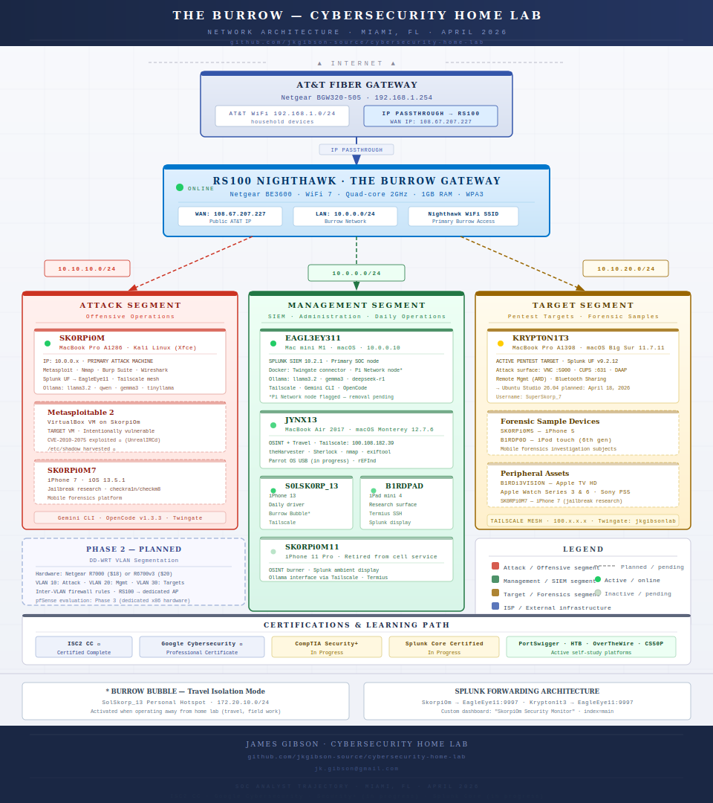

# 🔐 Cybersecurity Home Lab

A self-built cybersecurity home lab documenting my journey from hardware
refurbishment to penetration testing, digital forensics, network analysis,
OSINT, and SIEM monitoring. Built and maintained by a self-taught security
enthusiast transitioning into the cybersecurity field.

---

## 🔬 Home Lab Architecture



This lab simulates a segmented enterprise environment for purple team operations, 
including attack simulation (Kali), detection engineering (Splunk), and OSINT workflows.

## Development Workflow
All lab work follows a structured Git workflow to maintain clean version history and reproducibility. See `/docs/burrow_git_workflow_standard.md`.

---

## 🖥️ Lab Infrastructure

### Machines

| Machine | Hardware | OS / Role |
| --- | --- | --- |
| **Attack Machine** | Apple MacBook Pro A1286 Mid-2010 | Kali Linux (Xfce) — primary pentesting platform |
| **SIEM / AI Host** | Apple Mac mini M1 (2020) | macOS — Splunk Enterprise, Ollama, Docker |
| **OSINT Machine** | Apple MacBook Air 13" (2017) | macOS Monterey 12.7.6 — OSINT toolkit |
| **Target Machine (VM)** | Metasploitable 2 | VirtualBox on attack machine — intentionally vulnerable |
| **Target Machine (Physical)** | Apple MacBook Pro A1398 Mid-2014 | Bare metal — physical target / future AI dev workstation |

### Network & Remote Access

| Technology | Purpose | Nodes |
| --- | --- | --- |
| **Tailscale** | Mesh VPN — encrypted overlay network | Attack Machine, SIEM, OSINT Machine, iPhone 13, iPhone 11 Pro, iPad mini 4 |
| **Twingate** | Zero-trust remote lab access (jkgibsonlab.twingate.com) | Attack Machine ↔ SIEM |

### Virtualization & Storage

| Component | Details |
| --- | --- |
| **Virtualization** | VirtualBox |
| **External Storage** | "Bird's Nest" — Splunk data and Ollama model storage on SIEM |

---

## 🛠️ Skills Demonstrated

### Offensive Security

* Vulnerability scanning with Nmap
* Exploitation with Metasploit Framework
* Identified and exploited CVE-2010-2075 (UnrealIRCd backdoor)
* Identified and exploited vsftpd 2.3.4 backdoor (CVE-2011-2523)
* Post-exploitation enumeration (privilege escalation, credential harvesting)
* Password hash extraction from `/etc/shadow` and offline cracking

### OSINT

* Email and domain reconnaissance with theHarvester
* Network scanning with Nmap
* Username enumeration across platforms with Sherlock
* Image metadata analysis with ExifTool

### Network Analysis

* Packet capture and analysis with Wireshark
* TCP/IP protocol analysis (SYN, ACK, PSH, RST flags)
* TCP three-way handshake analysis
* DNS traffic analysis
* Unencrypted shell traffic capture and reconstruction via TCP stream follow

### SIEM & Detection

* Deployed Splunk Enterprise on Apple Silicon (M1)
* Configured Universal Forwarder on Kali Linux
* Built cross-machine log pipeline (Kali → Splunk via TCP 9997)
* Installed and configured Splunk Add-on for Unix and Linux
* Built real-time security monitoring dashboard
* Detected active exploitation in real time via netstat and process monitoring

### Digital Forensics

* iOS device forensics using libimobiledevice
* Full device backup and artifact extraction from Apple iPhone 5 and iPhone 7
* Timeline analysis of mobile device data
* Safari browsing history extraction via SHA1-hashed plist analysis
* SQLite database analysis with sqlitebrowser
* Application behavior analysis (network traffic, process monitoring, behavioral baselining)

### AI & Automation

* Deployed local LLM inference with Ollama across multiple machines
* Integrated Metasploit Framework with MCP (Model Context Protocol) via MetasploitMCP server
* Ran MetasploitMCP in HTTP/SSE mode on localhost for AI-driven tool invocation
* Configured AI agent (Hermes) with local model backend and security scanner

### System Administration

* Hardware refurbishment (battery replacement, HDD → SSD upgrades)
* Kali Linux installation and configuration from scratch
* NVIDIA GPU driver troubleshooting (nouveau driver stabilization)
* UFW firewall configuration
* SSH configuration and management
* systemd service configuration and troubleshooting
* Cross-platform file transfer via SCP
* Tailscale mesh network deployment and DNS conflict resolution

### Programming & Scripting

* Python development via Harvard CS50P (through Lecture 3 / Exceptions)
* Linux command-line scripting (bash)
* OverTheWire Bandit wargame progression (through Level 15)

---

## 🕵️‍♂️ Investigations

Explore hands-on cybersecurity investigations conducted in **The Burrow**:

📂 [View All Investigations](./investigations/README.md)

### 🔥 Highlighted Work

- 🔍 [Windows 7 Offline Data Recovery (DFIR)](./investigations/dfir/windows7_offline_data_recovery.md)   - Offline forensic recovery of user data from a locked legacy system
- 🌐 [Splunk Forwarder Network Incident](./investigations/network-analysis/splunk-forwarder-network-incident/splunk_forwarder_network_segmentation_case_study.md)   - Investigation of log forwarding issues and network visibility gaps
- 🛠️ [OpenVAS vs Nessus Scanner Comparison](./investigations/vulnerability-research/scanner_comparison_openvas_vs_nessus.md)   - Comparative analysis of vulnerability scanning tools in a lab environment

---

## 🔧 Featured Builds
- [KryptStick: Encrypted Persistent Multi-Boot Toolkit](./builds/kryptstick_persistent-multiboot.md)
 
---

## 📁 Projects

### 1. Home Lab Build

**Status:** ✅ Complete

Refurbished a 2010 MacBook Pro with a new battery and SSD, installed
Kali Linux, and configured it as a dedicated penetration testing machine.
Resolved system instability caused by NVIDIA nouveau driver by disabling
GPU acceleration.

**Tools:** Kali Linux, Xfce, VirtualBox

---

### 2. Metasploitable 2 — Penetration Test

**Status:** ✅ Complete

Set up Metasploitable 2 as a vulnerable target VM and conducted a full
penetration test using Metasploit Framework. Successfully exploited two
separate vulnerabilities to gain root access.

**Attack Chain:**

1. Network reconnaissance with Nmap (-sV service version detection)
2. Identified 23 open ports and multiple vulnerable services
3. Exploited UnrealIRCd backdoor (CVE-2010-2075) via Metasploit → root shell
4. Exploited vsftpd 2.3.4 backdoor (CVE-2011-2523) via Metasploit → root shell
5. Post-exploitation: enumerated users, processes, and harvested `/etc/shadow`
6. Extracted and cracked password hashes offline

**Tools:** Nmap, Metasploit Framework, Netcat

---

### 3. Network Traffic Analysis

**Status:** ✅ Complete

Captured and analyzed live network traffic during a penetration test
using Wireshark. Observed the complete attack chain at the packet level
including TCP handshakes, exploit delivery, and shell session traffic.

**Key Findings:**

* Captured SYN/ACK handshakes during Nmap port scanning
* Identified exploit traffic on port 6667 (IRC)
* Reconstructed unencrypted shell session via TCP stream follow
* Demonstrated why encrypted channels (SSH) are critical for secure communications

**Tools:** Wireshark, Nmap, Metasploit Framework

---

### 4. Splunk SIEM Deployment

**Status:** ✅ Complete

Designed and deployed a functional SIEM pipeline across two machines.
Configured real-time log collection, forwarding, and monitoring. Built
a custom security dashboard and successfully detected an active
exploitation attempt in real time.

**Architecture:**

```
Kali Linux (Attack Machine)
    ↓ Splunk Universal Forwarder
    ↓ TCP port 9997
Splunk Enterprise (Mac mini M1)
    ↓ index=main
Security Monitor Dashboard
```

**Dashboard Panels:**

* Active Network Connections (netstat)
* Open Ports Monitor (openPorts)
* Running Processes (ps)
* Command History (bash_history)

**Tools:** Splunk Enterprise 10.2.1, Splunk Universal Forwarder,
Splunk Add-on for Unix and Linux

---

### 5. iOS Digital Forensics

**Status:** ✅ Complete

Conducted forensic analysis of two Apple iOS devices using libimobiledevice.
Performed full device backups and extracted artifacts for timeline analysis.
Extracted and analyzed Safari browsing history from SHA1-hashed plist files,
queried SQLite databases directly, and reconstructed user activity timelines.

**Devices:** Apple iPhone 5, Apple iPhone 7

**Tools:** libimobiledevice, plistutil, sqlitebrowser, Kali Linux

---

### 6. Application Behavioral Analysis — Pi Network Node

**Status:** ✅ Complete

Prior to decommissioning a Pi Network Node installation on the SIEM host,
conducted a detailed behavioral examination of the application. Monitored
network connections, active processes, and system resource usage to document
and understand the software's runtime behavior before removal.

**Tools:** Splunk, netstat, ps, Kali Linux

---

### 7. AI-Assisted Red Team Pipeline (In Progress)

**Status:** 🔄 In Progress

Building an autonomous AI-assisted red team pipeline integrating a local
LLM (via Ollama), Metasploit Framework (via MetasploitMCP), and Splunk for
kill-chain monitoring. MetasploitMCP is deployed on the attack machine in
HTTP/SSE mode, enabling AI-driven tool invocation against lab targets.

**Architecture (target state):**

```
Ollama (local LLM)
    ↓ MCP client
MetasploitMCP (HTTP/SSE, port 8085)
    ↓ Metasploit Framework
Metasploitable 2 (target)
    ↓ logs
Splunk (kill-chain monitoring)
```

**Tools:** Ollama, MetasploitMCP, Metasploit Framework, Python, Splunk

---

## 📚 Learning Platforms & Coursework

* [Harvard CS50P](https://cs50.harvard.edu/python) — Python (through Lecture 3 / Exceptions)
* [OverTheWire Wargames](https://overthewire.org) — Bandit (through Level 15)
* [LabEx](https://labex.io) — Linux fundamentals
* [TryHackMe](https://tryhackme.com)

---

## 🎯 Certifications

### Completed

* ✅ **ISC2 Certified in Cybersecurity (CC)**
* ✅ **Google Cybersecurity Professional Certificate** *(Coursera)*

### Planned

* 📚 CompTIA Security+
* 📚 Splunk Core Certified User

---

## 📊 Tools & Technologies

[](https://www.kali.org)
[](https://www.splunk.com)
[](https://www.wireshark.org)
[](https://www.metasploit.com)
[](https://www.kernel.org)
[](https://www.virtualbox.org)
[](https://www.python.org)
[](https://ollama.com)

---

*This lab is for educational purposes only. All testing is performed
on intentionally vulnerable systems in an isolated environment.*

