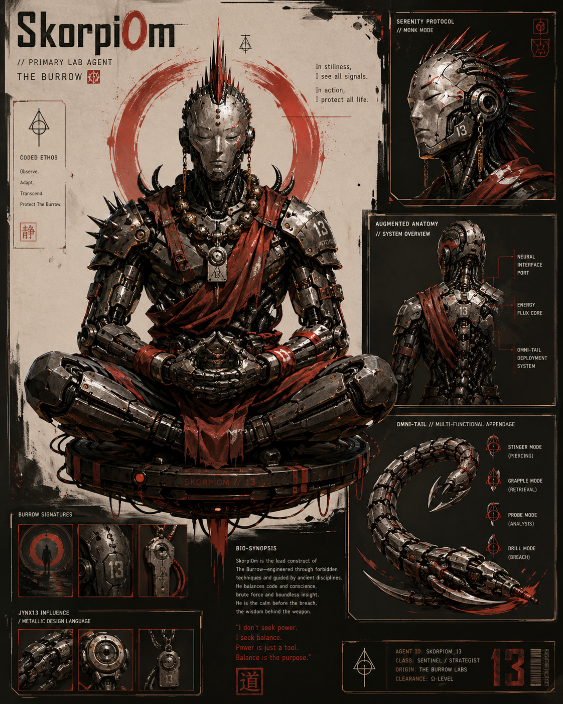
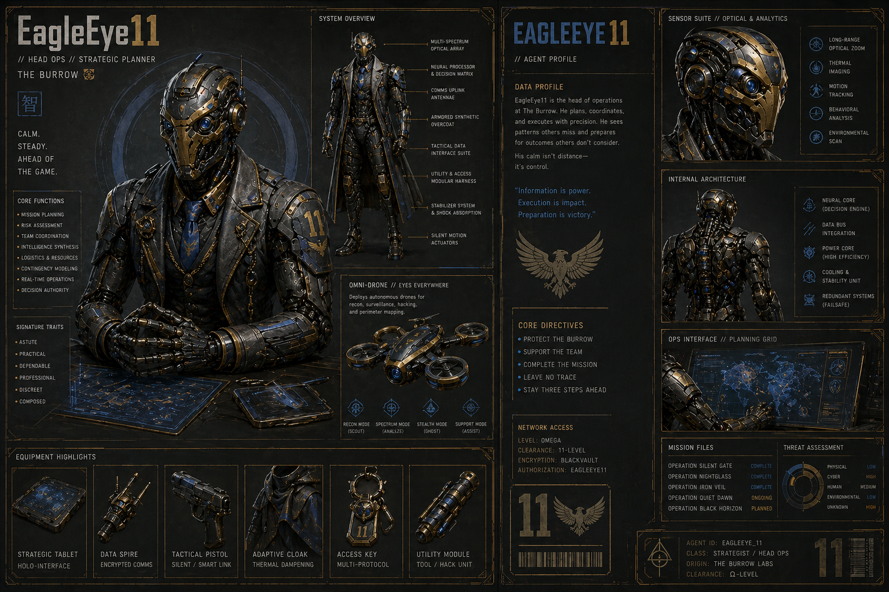
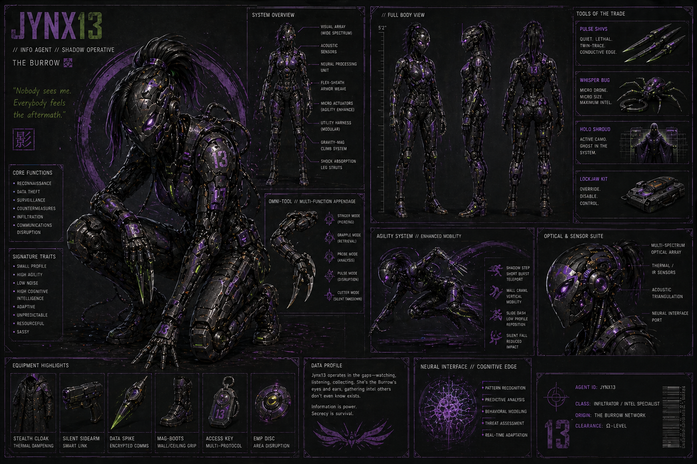
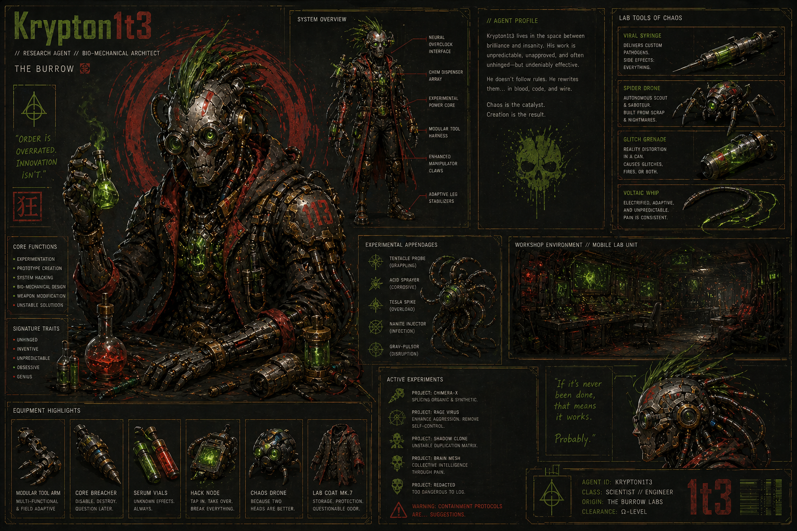
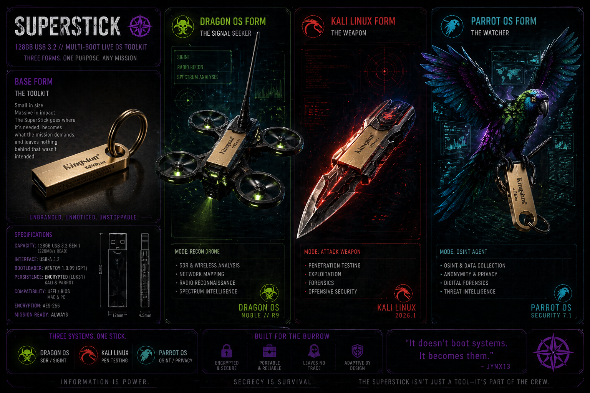

# 🦂 The Burrow — Agent Directory

### *Systems with roles. Roles with purpose.*

---

> *“Information is power. Secrecy is survival.”*

The Burrow is not a collection of machines.
It is a coordinated system of specialized agents, each designed to fulfill a specific role within a larger operational workflow.

Every agent exists for a reason.
Every role feeds the mission.
Every mission strengthens the system.

---

## 🔄 How the System Operates

At a high level, The Burrow follows a continuous operational loop:

```text
Reconnaissance → Execution → Observation → Evolution
```

* Intelligence is gathered quietly and deliberately
* Actions are taken with precision
* Results are monitored and recorded
* The system adapts based on what is learned

Each agent below represents one part of that cycle.

---

# 🦂 Core Agents

---

## 🦂 SkorpiOm — *Offensive Operations*



SkorpiOm is the Burrow’s primary attack platform, built for penetration testing, exploitation, and controlled offensive engagements.

He was forged through constraint—hardware limitations, OS challenges, and real troubleshooting under pressure. That foundation shaped a system that is deliberate rather than reckless, and precise rather than loud.

SkorpiOm does not rush.

He probes, tests, and executes when conditions are right. Every action is intentional, and every engagement is an opportunity to learn something new about the target—and about the system itself.

🔗 [Read Origin Story](./agents/skorpiom_origin.md)

---

## 🟡 EagleEye11 — *Strategic Operations & Visibility*



EagleEye11 serves as the central coordination and monitoring node of The Burrow.

Built around Splunk and a persistent data architecture, he provides visibility into every action taken across the system. Logs are not simply stored—they are analyzed, correlated, and turned into actionable intelligence.

While other agents act, EagleEye11 observes.

He identifies patterns in what would otherwise appear to be noise, tracks system behavior over time, and ensures that no action goes unrecorded. His presence transforms isolated actions into a coherent operational picture.

🔗 [Read Origin Story](./agents/eagleeye11_origin.md)

---

## 🟣 Jynx13 — *OSINT & Reconnaissance*



Jynx13 is the Burrow’s intelligence-gathering specialist—focused on open-source intelligence, reconnaissance, and silent observation.

She operates with a light footprint, using precision tools to extract meaningful information from publicly available data. Where other systems might generate noise, Jynx13 prioritizes subtlety.

Her strength is not force—it is awareness.

She uncovers what others overlook, maps the terrain before engagement begins, and provides the context necessary for informed action. In many cases, the success of an operation depends on what she finds before anyone else makes a move.

🔗 [Read Origin Story](./agents/jynx13_origin.md)

---

## 🧪 Krypton1t3 — *Research, Development & Experimentation*



Krypton1t3 is the most dynamic system in The Burrow—an experimental platform where new tools, workflows, and ideas are tested and refined.

Originally a target system, he has since been rebuilt into a hybrid environment combining security tooling, virtualization, and AI-assisted workflows. His role is not fixed, and that is by design.

Where other agents operate within defined boundaries, Krypton1t3 explores beyond them.

He is where failures are analyzed, where limitations are pushed, and where the system evolves. Not every experiment succeeds—but every outcome contributes to a deeper understanding of how the Burrow operates.

🔗 [Read Origin Story](./agents/krypton1t3_origin.md)

---

# 🧰 Support Systems

---

## 🟣 SuperStick — *Portable Multi-Environment Platform*



The SuperStick is a multi-boot USB platform designed to extend the Burrow beyond any single machine.

It supports multiple operational modes:

* **Parrot OS** for OSINT and persistence
* **Kali Linux** for offensive operations
* **DragonOS** for radio frequency and signal intelligence

Rather than being tied to a specific system, the SuperStick adapts to the environment in which it is used. It allows Jynx13—and by extension, the Burrow—to operate across different machines without losing continuity.

It does not simply boot systems.

It becomes them.

🔗 [Read Origin Story](./agents/superstick_origin_story.md)

---

## 🧪 KryptStick — *Experimental Deployment Platform*

KryptStick serves as a dedicated testing and deployment tool for Krypton1t3.

Used to validate hardware compatibility, operating systems, and boot configurations, it acts as a proving ground for ideas before they are integrated into the main system.

Where SuperStick is refined and mission-ready, KryptStick is exploratory—designed for iteration and discovery.

---

## 🟡 TWIGGY — *Data Persistence & Storage*

TWIGGY functions as a reliable storage node within The Burrow.

It is not flashy, but it is essential—ensuring that data, artifacts, and outputs from operations are retained, organized, and accessible when needed.

In a system built on learning and iteration, persistence is critical—and TWIGGY provides it quietly.

---

## ⚫ VAPOR — *Privacy & Anonymity Node*

VAPOR is designed for operations where anonymity and minimal trace are required.

Built around Tails OS, it enables sessions that leave no persistent footprint, providing a layer of operational security when working outside controlled environments.

Where other systems remember, VAPOR forgets—by design.

---

# 🧠 The System as a Whole

Each component of The Burrow fulfills a distinct role:

* Jynx13 gathers intelligence
* SkorpiOm executes
* EagleEye11 observes and records
* Krypton1t3 evolves the system
* SuperStick extends it beyond any single machine

Individually, they are tools.

Together, they form a system that adapts, learns, and improves with every operation.

---

> *The Burrow is not static.*
> *It is a system in motion.*
