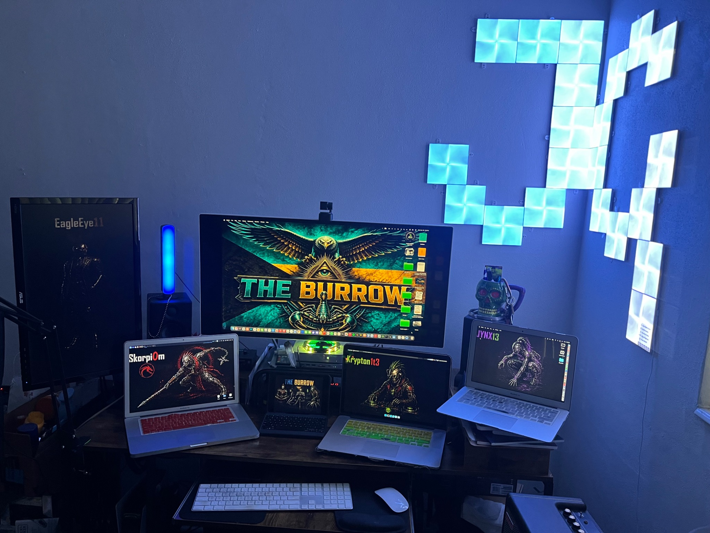
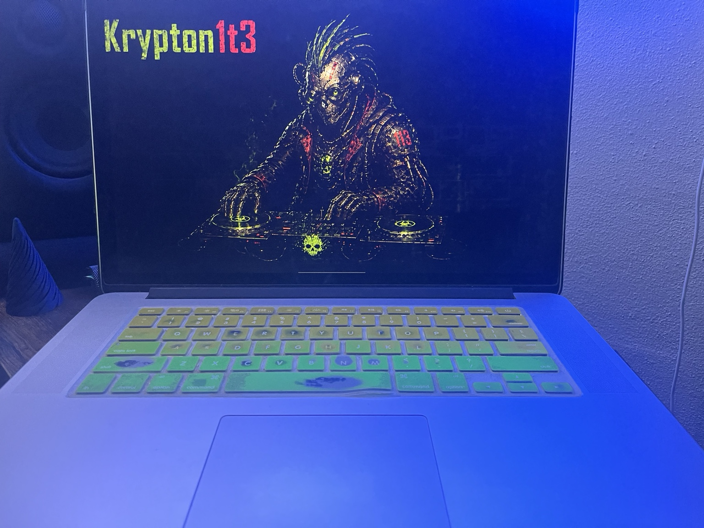
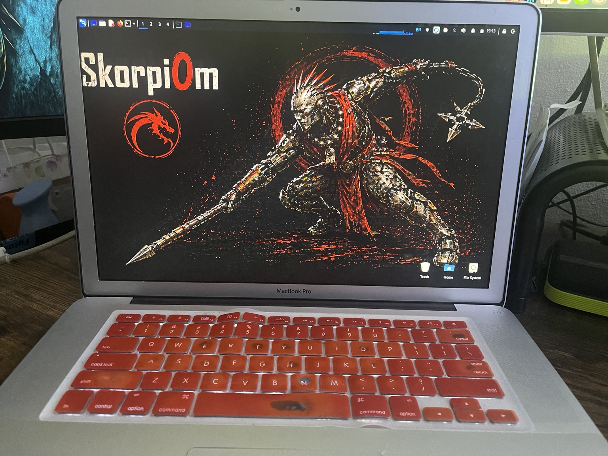
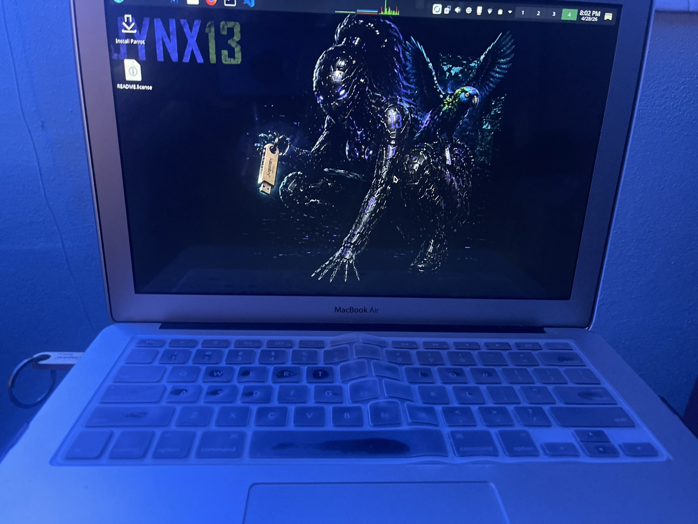
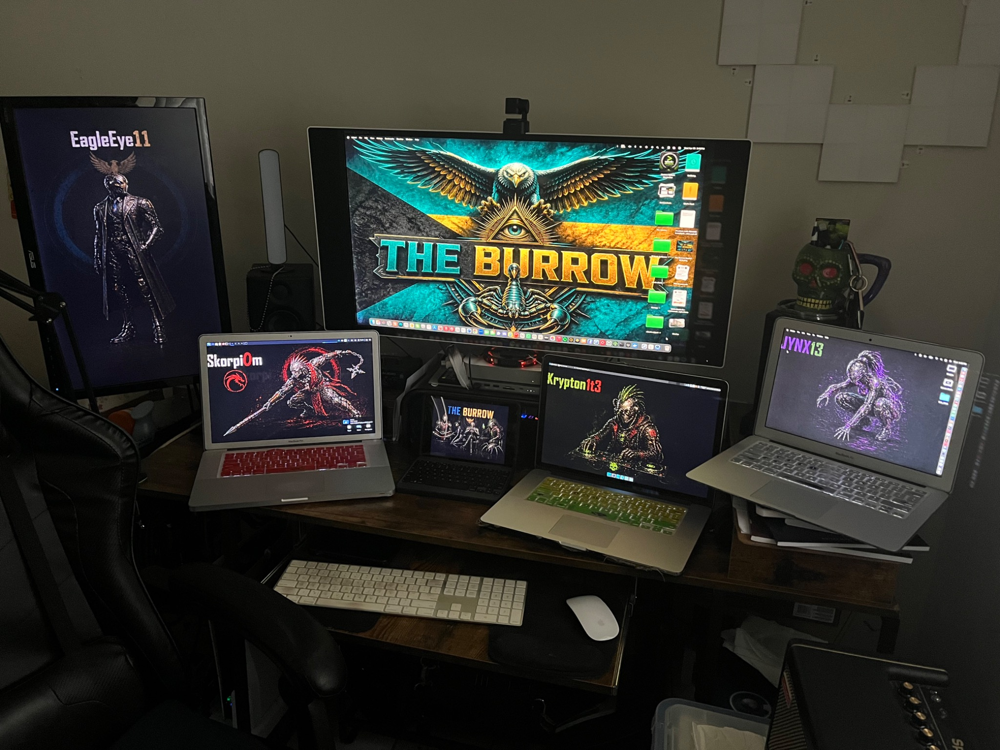

# 🖥️ The Burrow Command Center

> ⚠️ This is a live operational environment.  
> The images below represent the physical implementation of the Burrow architecture.

---

## 🧠 Overview

The Burrow is a multi-node cybersecurity home lab built around role-based system identity and coordinated operations. Each machine has a defined purpose — offensive ops, AI and agent development, field recon, or observability — and the lab is designed so those roles stay clean and don't bleed into each other.

At the center of everything is **EagleEye11**, the awareness and control hub that everything else reports to.

---

## 🦅 Central Operations

### **EagleEye11 — Central Ops / Observability Node**

The nerve center of The Burrow. EagleEye11 runs Splunk Enterprise for SIEM and log aggregation, with Wazuh handling host-based intrusion detection and file integrity monitoring across the lab. It anchors the mesh network via Tailscale and Twingate, and hosts Ollama for local LLM inference. All telemetry across the lab flows here.

> *If the Burrow is alive, EagleEye11 is its awareness.*

---

## 🔧 Active Nodes

### 🟢 **Krypton1t3 — Forge Node**
AI workloads, agent development, and experimental tooling.

Krypton1t3 runs Fedora Security Lab and carries the heaviest local AI stack in the lab — multiple Ollama models including DeepSeek-Coder, Mistral, and Phi variants. It's where Hermes Agent and Gemini CLI live, and where new tools and pipelines get built and tested before they're trusted anywhere else.

---

### 🔴 **SkorpiOm — Offensive Ops Node**
Adversarial simulation and penetration testing.

SkorpiOm is the primary attack box, running Kali Linux on a MacBook Pro A1286. It carries the full offensive toolkit — Metasploit (with MetasploitMCP for Claude integration), nmap, theHarvester, Sherlock, and a Splunk Universal Forwarder shipping logs back to EagleEye11 in real time. Red team workflows start here.

---

### 🟣 **Jynx13 — Field Unit (SuperStick Platform)**
Mobile OSINT and live-environment operations.

Jynx13 is a MacBook Air 2017 running macOS natively, but its real capability comes from the SuperStick — a 128GB Kingston USB 3.2 drive running Ventoy with Parrot OS, Kali, and DragonOS available as live-boot options. LUKS-encrypted persistence and a local Ollama instance make it a fully self-contained field unit that doesn't depend on the home network.

---

## 🖥️ Command Center

The central display runs EagleEye11 — Mac mini M1 — reinforcing its role as the system-wide observability layer. SkorpiOm, Jynx13, and Krypton1t3 are arranged across the desk, each running their node wallpaper as a persistent visual reminder of role identity.

---

## 🎯 Design Philosophy

The Burrow is built on three principles that shape every decision about how machines are configured, named, and used:

**Role-Based System Identity** — each machine has a defined operational scope and doesn't drift outside it. SkorpiOm attacks. Krypton1t3 builds. Jynx13 recons. EagleEye11 watches.

**Separation of Concerns** — workloads are distributed deliberately. Keeping offensive tooling off the observability node, and experimental AI work off the attack box, isn't just good security hygiene — it keeps the lab coherent as it scales.

**Identity-Driven Design** — naming conventions, wallpapers, and keyboard colors aren't cosmetic. They're operational anchors. In a multi-machine environment, visual identity reduces cognitive load and keeps context clear at a glance.

---

## 🧩 Architecture Summary

| Layer | System | Role |
|-------|--------|------|
| 🧠 | EagleEye11 | Splunk SIEM · Wazuh · Tailscale · LLM inference |
| 🟢 | Krypton1t3 | Ollama · Agent dev · Forge / Experimentation |
| 🔴 | SkorpiOm | Kali · Metasploit · Offensive operations |
| 🟣 | Jynx13 | Parrot OS · Ventoy · Field recon |

## 🛜 [Remote Access Architecture](/architecture/remote-access-architecture_c.md)

## 👀 [WatchYourLAN Deployment](/architecture/watchyourlan_burrow_architecture_c.md)

---

## 🦾 The Burrow

**Awareness • Protection • Purpose**

A coordinated cybersecurity lab with real tooling, real identity, and a growing portfolio of documented engagements.
