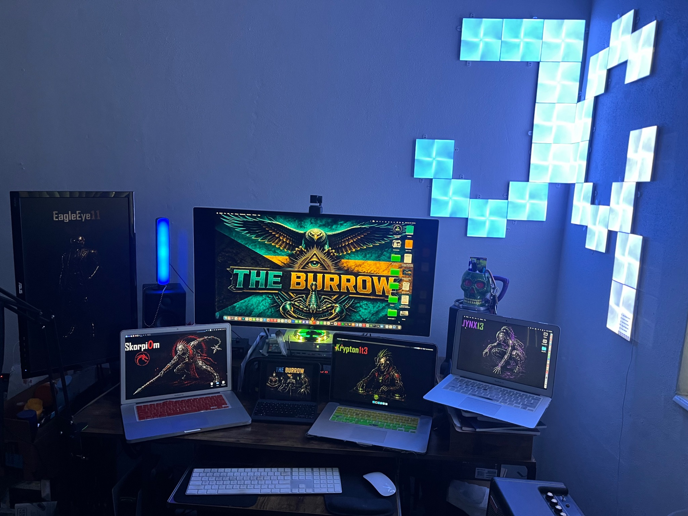
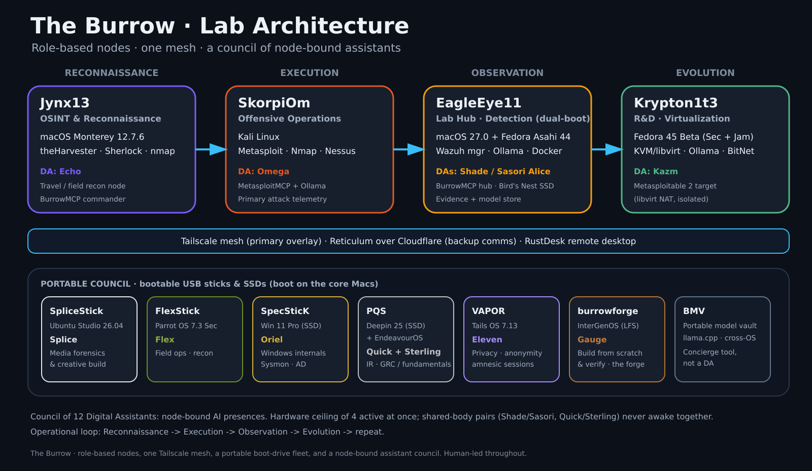
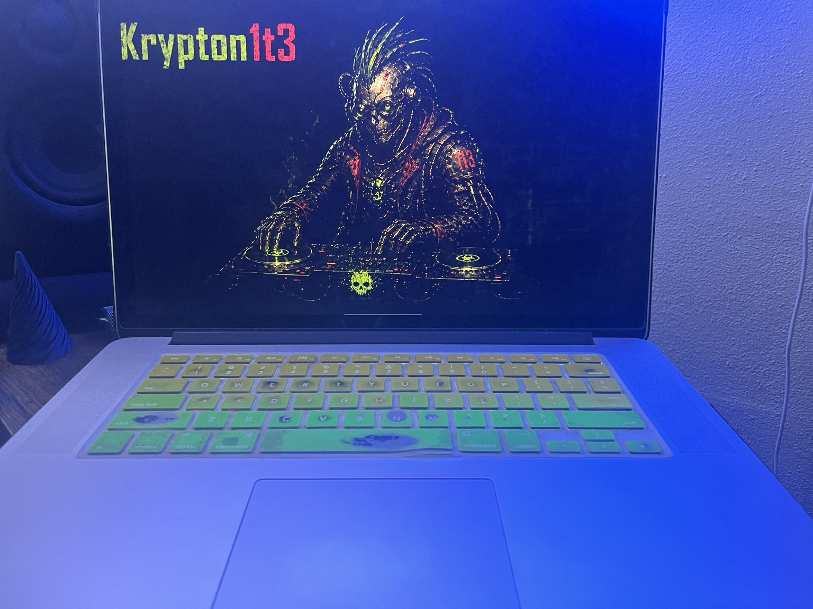
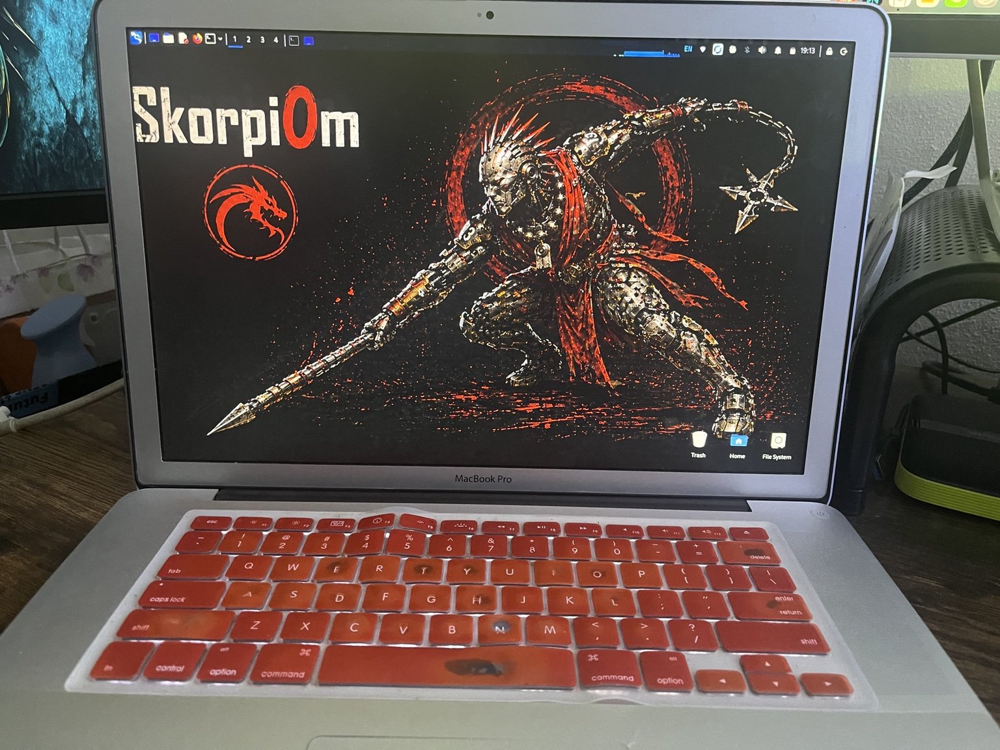
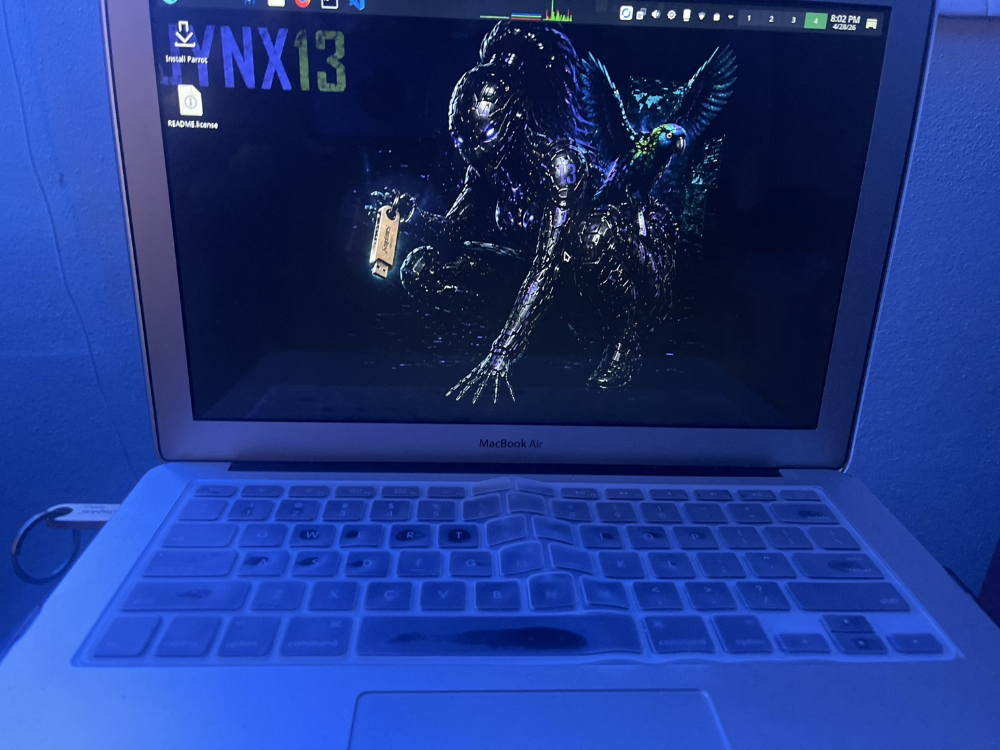
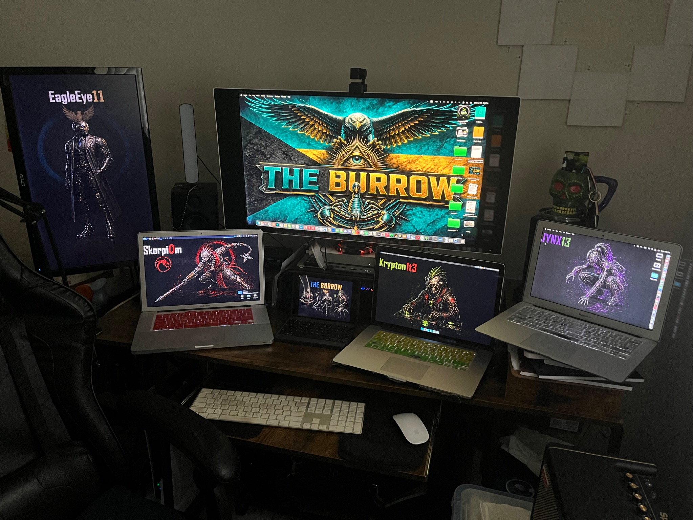

# 🖥️ The Burrow Command Center

> ⚠️ This is a live operational environment.
> The images below represent the physical implementation of the Burrow architecture.

---

## 🧠 Overview

The Burrow is a multi-node cybersecurity home lab built around role-based system
identity and coordinated operations. Each machine has a defined purpose (offensive
ops, AI and agent development, field recon, or observability) and the lab is
designed so those roles stay clean and don't bleed into each other.

Four core Mac machines form the backbone. Around them runs a fleet of portable
boot drives (USB sticks and SSDs), each carrying its own operating system and
workflow, and a council of node-bound AI assistants. At the center of everything
is **EagleEye11**, the awareness and control hub that everything else reports to.

---

## 🦅 Central Operations

### **EagleEye11 — Central Ops / Observability Node**

The nerve center of The Burrow. EagleEye11 runs **Wazuh** as the lab's primary
detection layer (host-based intrusion detection and file-integrity monitoring
across the core nodes), hosts Ollama for local LLM inference, and runs Docker and
the BurrowMCP hub. It anchors the mesh over Tailscale, with Reticulum over
Cloudflare tunnels as a Tailscale-independent backup path. Splunk was the lab's
original SIEM and is documented in the portfolio, but it has since been phased out
in favor of Wazuh used on demand. All telemetry across the lab flows here.

EagleEye11 is now a **dual-boot** machine: macOS 27.0 alongside Fedora Asahi Remix
44 on Apple Silicon. The Fedora side is home to Sasori Alice, the newest DA, while
Shade watches from the macOS side.

Attached storage is the **Bird's Nest** external SSD, which holds Ollama models,
Docker data, Wazuh data, and the bulk pentest-evidence store. SkorpiOm's original
500GB drive lives in the same enclosure, re-housed as **Phoenix**.

> *If the Burrow is alive, EagleEye11 is its awareness.*

---

## 🔧 Active Nodes

### 🟢 **Krypton1t3 — Forge Node**
AI workloads, agent development, virtualization, and experimental tooling.

Krypton1t3 runs **Fedora 45 Beta (Security + Jam Labs)** and carries the heaviest
local AI stack in the lab: multiple Ollama models, plus Jan and BitNet for local
inference. It runs a KVM/libvirt virtualization lab (a Kali VM and the
Metasploitable 2 target on an isolated NAT network), and it's where new tools and
pipelines get built and tested before they're trusted anywhere else. Its DA is
Kazm.

---

### 🔴 **SkorpiOm — Offensive Ops Node**
Adversarial simulation and penetration testing.

SkorpiOm is the primary attack box, running Kali Linux on a MacBook Pro A1286. It
carries the full offensive toolkit: Metasploit (with MetasploitMCP for Claude
integration), nmap, Nessus, theHarvester, and Sherlock. Red team workflows start
here, and its DA is Omega.

---

### 🟣 **Jynx13 — Field / Travel Node**
Mobile OSINT and live-environment operations.

Jynx13 is a MacBook Air 2017 running macOS Monterey 12.7.6. It's the lab's travel
and reconnaissance node and runs a local BurrowMCP commander instance so the lab
can be driven from the field over Tailscale. Its DA is Echo.

---

## 💾 The Portable Council

Much of the Burrow's range now lives on portable boot drives rather than fixed
machines. Each stick or SSD carries its own OS and its own DA, and most boot on
both Krypton1t3 and Jynx13:

| Drive | OS | DA | Focus |
|-------|----|----|-------|
| **SpliceStick** | Ubuntu Studio 26.04 | Splice | Creative production, media forensics |
| **FlexStick** | Parrot OS 7.3 Security | Flex | Field ops, recon, OSINT |
| **SpecSticK** (SSK SSD) | Windows 11 Pro (Hasleo WinToUSB) | Oriel | Windows internals, Sysmon, AD |
| **PQS** (SSK SSD) | Deepin 25 + EndeavourOS (dual-boot) | Quick + Sterling | Incident response, GRC / fundamentals |
| **VAPOR** | Tails OS 7.13 | Eleven | Privacy, anonymity, amnesic sessions |
| **burrowforge** | InterGenOS (Linux From Scratch) | Gauge | Build from scratch and verify |
| **BMV** (PNY) | llama.cpp, cross-platform | *(concierge, not a DA)* | Portable AI model vault |

> The retired **SuperStick** and **KryptStick** names have been superseded:
> KryptStick was split into SpliceStick and FlexStick, and the SuperStick / Kingston
> lineage produced SpecSticK and was later rebuilt into the burrowforge InterGenOS node.

Full DA roster and roles: **[Agent Directory](../nodes/README.md)**.

---

## 🖥️ Command Center

The central display runs EagleEye11 (Mac mini M1), reinforcing its role as the
system-wide observability layer. SkorpiOm, Jynx13, and Krypton1t3 are arranged
across the desk, each running its node wallpaper as a persistent visual reminder
of role identity.

---

## 🎯 Design Philosophy

The Burrow is built on three principles that shape every decision about how
machines are configured, named, and used:

**Role-Based System Identity** - each machine has a defined operational scope and
doesn't drift outside it. SkorpiOm attacks. Krypton1t3 builds. Jynx13 recons.
EagleEye11 watches.

**Separation of Concerns** - workloads are distributed deliberately. Keeping
offensive tooling off the observability node, and experimental AI work off the
attack box, isn't just good security hygiene. It keeps the lab coherent as it
scales.

**Identity-Driven Design** - naming conventions, wallpapers, and keyboard colors
aren't cosmetic. They're operational anchors. In a multi-machine environment,
visual identity reduces cognitive load and keeps context clear at a glance. That
identity extends to the DA council: each node carries a node-bound assistant, with
a hardware ceiling of four DAs active at once and shared-body pairs (Shade/Sasori
on EagleEye11, Quick/Sterling on PQS) never awake at the same time.

---

## 🧩 Architecture Summary

| Layer | System | Role |
|-------|--------|------|
| 🦅 | EagleEye11 | Wazuh detection · Ollama · Docker · BurrowMCP hub · dual-boot (macOS + Asahi) |
| 🟢 | Krypton1t3 | Fedora 45 Beta · KVM/libvirt · Ollama / Jan / BitNet · forge |
| 🔴 | SkorpiOm | Kali · Metasploit · offensive operations |
| 🟣 | Jynx13 | macOS Monterey · OSINT · travel / field node |
| 💾 | Portable fleet | SpliceStick · FlexStick · SpecSticK · PQS · VAPOR · burrowforge · BMV |

## 🛜 [Remote Access Architecture](/architecture/remote-access-architecture_c.md)

## 👀 [WatchYourLAN Deployment](/architecture/watchyourlan_burrow_architecture_c.md)

---

## 🦾 The Burrow

**Awareness • Protection • Purpose**

A coordinated cybersecurity lab with real tooling, real identity, and a growing
portfolio of documented engagements.
