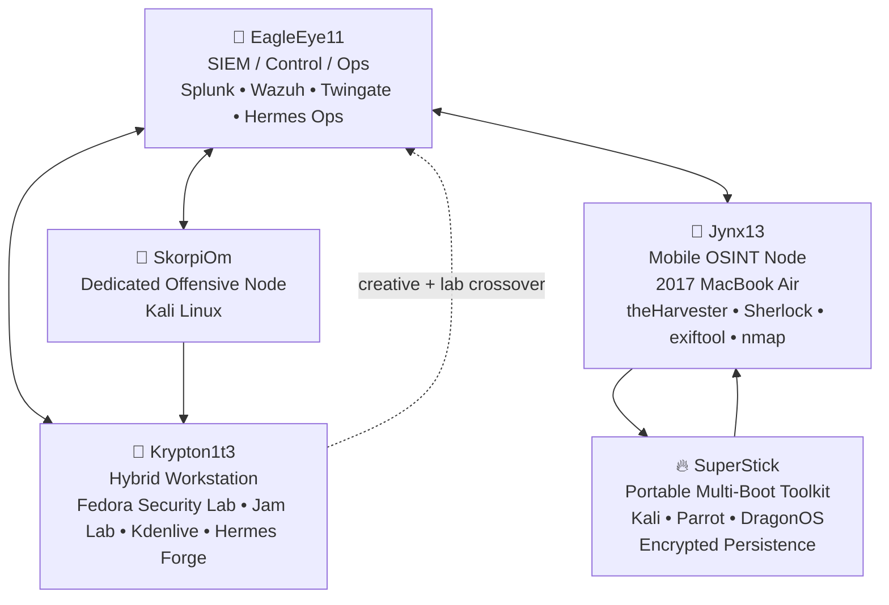
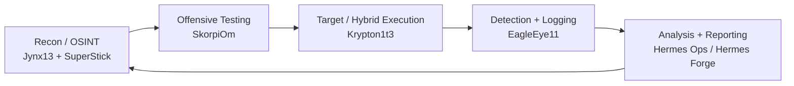

# 🦂 The Burrow — Architecture Diagram

_Last Updated: 2026-04-25_

> **A modular cybersecurity, creative, and AI-assisted lab ecosystem built around intentional role separation, controlled flexibility, and iterative growth.**

---

## 🧬 Current System Architecture

---

## 🧭 Node Roles

| Node | Primary Role | Secondary Role | Identity |
|---|---|---|---|
| 🦅 EagleEye11 | Monitoring / SIEM / Control | Ops coordination | Visibility layer |
| 🦂 SkorpiOm | Offensive testing | Dedicated Kali box | Attack platform |
| 🧠 Krypton1t3 | Hybrid Fedora workstation | Creative production + lab work | Execution + creation |
| 🐾 Jynx13 | OSINT / mobile recon | Travel system | Portable intelligence node |
| 🔥 SuperStick | Multi-boot field toolkit | Encrypted persistence | Adaptive deployment layer |

---

## 🧠 Functional Layers

---

## 🧩 Design Philosophy

The Burrow is not designed around perfect isolation.  
It is designed around **intentional control**.

Core principles:

- Separate roles where separation matters.
- Allow hybrid use where flexibility adds value.
- Keep dedicated offensive capability isolated.
- Maintain visibility through SIEM and logging.
- Use AI as an augmentation layer, not a replacement for judgment.
- Document the system as it evolves.

---

## 🧬 System Identity

> **The Burrow is a living lab ecosystem: part cybersecurity range, part creative workstation environment, part AI-assisted research platform.**

---

## 🔗 Related Documents

- Burrow Evolution Timeline (see /architecture/burrow_evolution_timeline_c.md)
