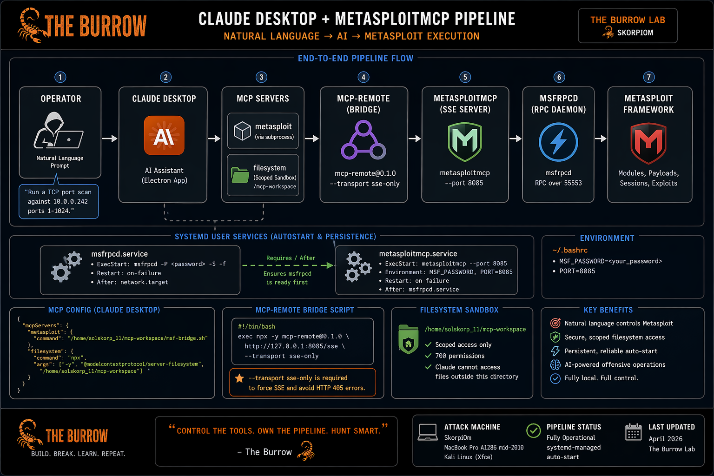

# 🦂 The Burrow



## 🔥 Claude Desktop + MetasploitMCP Pipeline

### 🛠️ Build Report \| The Burrow Lab \| April 2026

------------------------------------------------------------------------

## 🦂 Overview

This document describes the process of building a fully functional
natural language → AI → Metasploit pipeline on a Kali Linux attack
machine using Claude Desktop and MetasploitMCP.

**Attack Machine:** 🦂 SkorpiOm --- Kali Linux (Xfce)\
**Pipeline:** Claude Desktop → mcp-remote → MetasploitMCP → msfrpcd →
Metasploit Framework\
**Status:** Fully operational with systemd-managed auto-start

------------------------------------------------------------------------

## 🧰 Prerequisites

-   Kali Linux\
-   nodejs / npm\
-   Metasploit Framework\
-   MetasploitMCP\
-   Anthropic account

------------------------------------------------------------------------

## ⚙️ Installation & Configuration

*(All original commands and configs preserved)*

### Install

``` bash
sudo apt update && sudo apt install -y git libfuse2 imagemagick p7zip-full icoutils
```

### Bridge Script

``` bash
exec npx -y mcp-remote@0.1.0 http://127.0.0.1:8085/sse --transport sse-only
```

### MCP Config

``` json
{
  "mcpServers": {
    "metasploit": {
      "command": "/home/solskorp_11/mcp-workspace/msf-bridge.sh"
    }
  }
}
```

------------------------------------------------------------------------

## 🔁 systemd Services

``` bash
ExecStart=/usr/bin/msfrpcd -P <password> -S -f
ExecStart=/usr/bin/metasploitmcp --port 8085
```

------------------------------------------------------------------------

## 🚀 Execution

Natural language example:

    Run a TCP port scan against 10.0.0.242 ports 1-1024

------------------------------------------------------------------------

## 🛠️ Troubleshooting

  Symptom          Cause               Fix
  ---------------- ------------------- --------------
  Cannot connect   Services down       Restart
  Auth failed      Password mismatch   Sync creds
  405 error        Wrong transport     Use sse-only

------------------------------------------------------------------------

## 📁 File Reference

  File       Location
  ---------- -------------------
  Config     \~/.config/Claude
  Bridge     mcp-workspace
  Services   systemd

------------------------------------------------------------------------

## 🧠 Key Lessons

-   Lock ports\
-   Respect startup order\
-   Use sse-only\
-   Trust connectors\
-   Scope filesystem

------------------------------------------------------------------------

## 🧬 MITRE ATT&CK Mapping

  ----------------------------------------------------------------------------
  Technique         ID                Description       Where It Appears
  ----------------- ----------------- ----------------- ----------------------
  Active Scanning   T1595             Network           Metasploit TCP scans
                                      reconnaissance    
                                      via port scanning 

  Network Service   T1046             Identifying open  scanner/portscan/tcp
  Discovery                           ports/services    

  Command and       T1071             Application layer MCP + RPC
  Control                             protocol usage    communication

  Remote Services   T1021             Interacting with  Metasploit sessions
                                      remote systems    

  Execution         T1059             Command execution Metasploit modules
                                      via framework     

  Persistence       T1547             Maintaining       systemd services
                                      service startup   

  Defense Evasion   T1562             Avoiding          Local AI pipeline
                                      detection via     
                                      custom tooling    

  Exfiltration Over T1041             Data returned via Claude responses
  C2                                  RPC/AI channel    
  
  ----------------------------------------------------------------------------

------------------------------------------------------------------------

## 🦂 Footer

Built in 🦂 The Burrow Lab\
Cybersecurity Home Lab \| 2026
