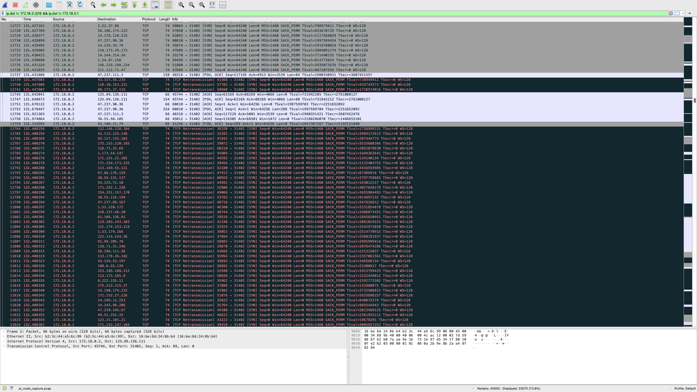
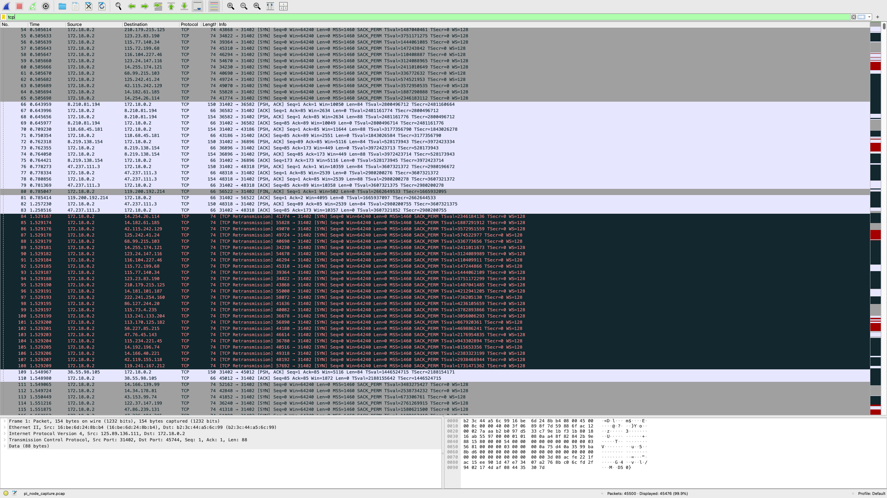
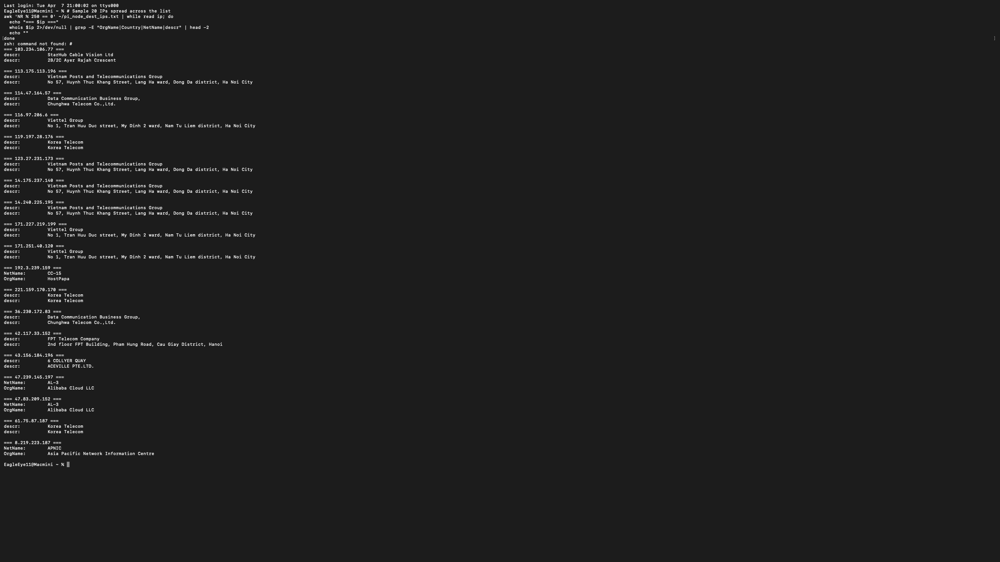
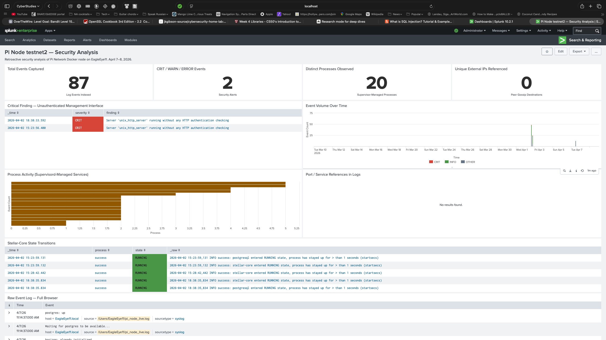
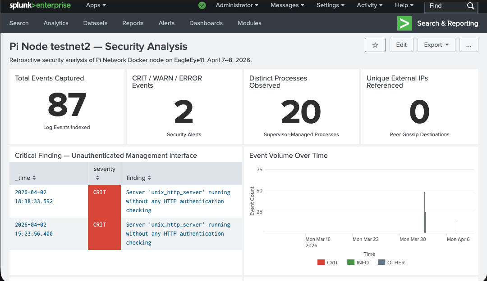
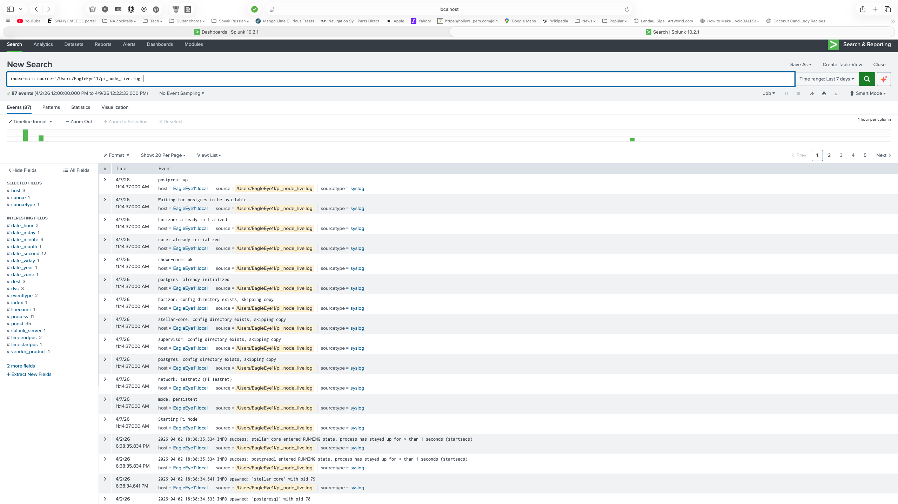
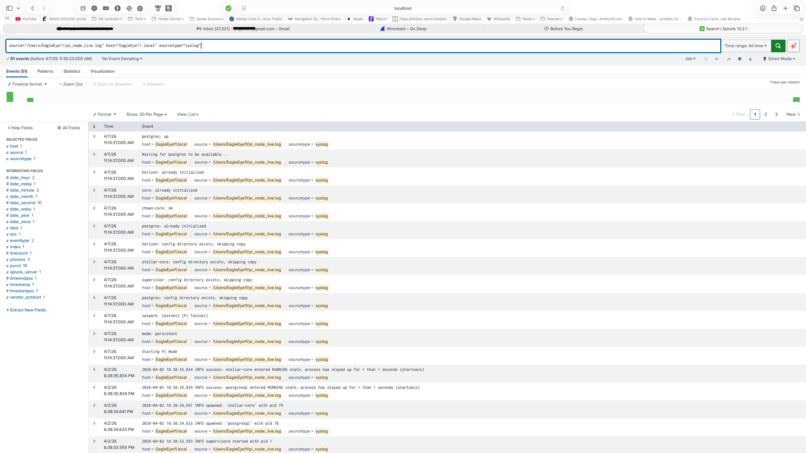
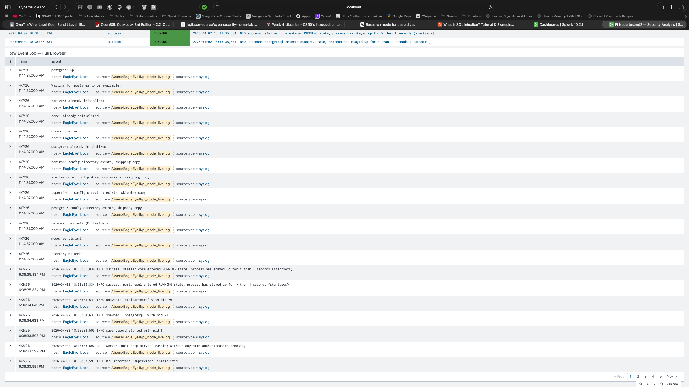

# Pi Network Node (testnet2) — Security Analysis Report

**Date:** April 7–8, 2026  
**Lab:** The Burrow | Miami  
**Analyst:** JBird (`jkgibson-source`)  
**Host Machine:** EagleEye11 — Apple Mac mini M1, macOS, Splunk SIEM  
**Subject:** `testnet2` — Pi Network Docker node container  
**Status:** Decommissioned following analysis

---

## 📋 Executive Summary (BLUF)

A structured security analysis was conducted on the Pi Network `testnet2` Docker container prior to its decommission from the core SIEM host (`EagleEye11`). The analysis identified multiple **High-Severity** risks that necessitated immediate removal to preserve the integrity of the lab's monitoring infrastructure.

### Key Findings
* **Credential Exposure:** Hardcoded Stellar blockchain private keys and database passwords were found in plaintext within environment variables.
* **Management Vulnerability:** The `supervisord` management interface was running with zero authentication, a critical flaw surfaced via Splunk alerting.
* **Network Aggression:** The node performed aggressive peer-discovery, contacting **4,989 unique external IPs** within a 5-minute window, bypassing DNS-based controls via hardcoded IP routing.
* **Insecure Isolation:** Port bindings were exposed to the entire LAN (`0.0.0.0`), and read-write bind mounts granted the container access to the host’s home directory.

### Conclusion
While the observed traffic is consistent with blockchain "peer-sweep" behavior, the lack of resource limits, use of an EOL base image, and plaintext secret storage represent an unacceptable trust boundary. The container has been decommissioned, and a remediation timeline has been established to harden the remaining lab assets.

---

## Table of Contents

1. [Objective](#objective)
2. [Background — Docker vs. VM Isolation](#background)
3. [Phase 1 — Container Inspection](#phase-1--container-inspection)
4. [Phase 2 — Traffic Capture](#phase-2--traffic-capture)
5. [Phase 3 — Traffic Analysis (Wireshark)](#phase-3--traffic-analysis-wireshark)
6. [Phase 4 — IP Intelligence & Geographic Analysis](#phase-4--ip-intelligence--geographic-analysis)
7. [Phase 5 — Splunk Log Analysis](#phase-5--splunk-log-analysis)
8. [Phase 6 — Resource Monitoring](#phase-6--resource-monitoring)
9. [Findings Summary](#findings-summary)
10. [Evidence Files](#evidence-files)
11. [Key Learnings](#key-learnings)
12. [Remediation & Next Steps](#remediation--next-steps)

---

## Objective

Before removing the Pi Network Docker node (`testnet2`) from EagleEye11, this decommission was treated as a structured security analysis exercise. The goals were to capture network traffic, enumerate open ports, monitor resource usage, analyze network behavior, and document findings for the cybersecurity portfolio.

This is an ethically clean, self-contained exercise — EagleEye11 is personally owned lab infrastructure. No third-party systems were targeted.

---

## Background

### Docker ≠ VM (Key Conceptual Takeaway)

A prior assumption was that Docker provided VM-like isolation. This session disproved that.

Docker containers share the host kernel — there is no hypervisor boundary. The bridge network provides process-level network namespacing, but port bindings to `0.0.0.0` expose those ports to the entire LAN. A compromised or misbehaving container can affect the host in ways a VM cannot. This distinction is critical on a SIEM machine where integrity is paramount.

---

## Phase 1 — Container Inspection

**Command used:**
```bash
docker inspect testnet2
```

### Network Configuration

| Parameter | Value |
|---|---|
| Network Mode | Custom bridge `pi-network_default` |
| Container IP | `172.18.0.2` |
| Gateway | `172.18.0.1` |
| Isolation | Internal bridge only — ports forwarded to `0.0.0.0` (LAN-exposed) |

### Port Bindings

All three exposed ports were bound to `0.0.0.0`, making them reachable from anywhere on the LAN:

| Container Port | Host Port | Service |
|---|---|---|
| 1570/tcp | 31403 | Stellar peer |
| 31402/tcp | 31402 | Stellar peer gossip |
| 8000/tcp | 31401 | HTTP interface |
| 5432/tcp | (internal only) | PostgreSQL |

### Findings from Inspect

**[HIGH] Plaintext credentials in environment variables:**
```
POSTGRES_PASSWORD=beqgxxxxxxxxxxNuYi7s
NODE_PRIVATE_KEY=SA5QH2VWQI4VNZ3SOLPRYIU5XXXXXXXXXXXXXXXPLHF2OPAJYRCB4PCF
```
The `NODE_PRIVATE_KEY` is a Stellar blockchain private key stored in plaintext — visible to anyone with Docker access on the host. Secrets should never be passed as plaintext environment variables; secrets management tooling (Docker secrets, environment files with restricted permissions, or a vault) should be used instead.

**[MEDIUM] Read-write bind mounts to host filesystem:**
```
~/Library/Application Support/Pi Network/docker_volumes/testnet_2/stellar     → /opt/stellar
~/Library/Application Support/Pi Network/docker_volumes/testnet_2/supervisor_logs → /var/log/supervisor
~/Library/Application Support/Pi Network/docker_volumes/testnet_2/history     → /history
```
A container escape or malicious container process would have direct read-write access to the host home directory subtree.

**[MEDIUM] No resource limits configured:** `Memory: 0`, `NanoCpus: 0` — the container can consume all available host memory and CPU unchecked. On a SIEM with 8GB unified memory also running Splunk and Ollama, this is a significant stability risk.

**[MEDIUM] EOL base image:** `pinetwork/pi-node-docker:community-v1.1-p21.2` running Ubuntu 20.04, which reached end-of-life in April 2025. No further security patches are available for this base image.

---

## Phase 2 — Traffic Capture

### Challenge: Docker Desktop on macOS

The bridge interface `br-96ee3834c46e` exists inside Docker Desktop's hidden Linux VM — not on macOS itself. Running `tcpdump` on the macOS host returns `No such device exists`. This is a key architectural difference from Docker on Linux, where bridge interfaces are real host interfaces accessible to `tcpdump`.

### Solution: Capture from Inside the Container

```bash
docker exec -it testnet2 bash
apt-get install -y tcpdump
tcpdump -i eth0 -w /tmp/pi_node_inside.pcap
# ~5 minutes of capture, then Ctrl+C
exit
docker cp testnet2:/tmp/pi_node_inside.pcap ~/pi_node_capture.pcap
```

**Result:** 45,500 packets captured | 8.8MB pcap file

---

## Phase 3 — Traffic Analysis (Wireshark)

### DNS Filter: `dns`

**Result: 0 packets.** The container uses zero DNS resolution. All peers are contacted by hardcoded IP address. This means the node bypasses DNS-based network filtering and monitoring entirely — a noteworthy behavior for any container running on sensitive infrastructure.

### External Traffic Filter: `ip.dst != 172.18.0.0/16`

- **33,670 of 45,500 packets (73.8%) were outbound to external IPs**
- All outbound traffic targeting port `31402` (Stellar peer gossip)
- Large volume of TCP Retransmissions — the node spray-connects to a full peer list; most peers are unreachable, generating repeated retransmit attempts


*Wireshark display filter `ip.dst != 172.18.0.0/16` showing 33,570 external packets (73.8% of capture). Heavy TCP Retransmission volume consistent with aggressive peer sweep behavior.*


*Early capture segment showing initial TCP SYN connections to diverse external IPs, all targeting port 31402 (Stellar peer gossip). This precedes the retransmission flood.*

### Unique Destination IP Extraction

```bash
tshark -r ~/pi_node_capture.pcap -T fields -e ip.dst \
  | sort -u | grep -v "^172\.18\." > ~/pi_node_dest_ips.txt
wc -l ~/pi_node_dest_ips.txt
# → 4,989 unique destination IPs in ~5 minutes
```

**4,989 unique external IPs contacted in approximately 5 minutes** of normal container operation.

---

## Phase 4 — IP Intelligence & Geographic Analysis

### WHOIS Sample (20 IPs across the list)

Heavy Asia-Pacific concentration — consistent with Pi Network's largest user base:

| Region | Organizations |
|---|---|
| Vietnam | VNPT, Viettel Group, FPT Telecom |
| Taiwan | Chunghwa Telecom, Data Communication Business Group |
| South Korea | Korea Telecom |
| China / Cloud | Alibaba Cloud LLC |
| Singapore | Aceville Pte. Ltd. |
| US | HostPapa, APNIC-allocated ranges |


*WHOIS results for a 20-IP sample spread across the full destination list. Dominant APAC concentration: VNPT/Viettel (Vietnam), Chunghwa Telecom (Taiwan), Korea Telecom, Alibaba Cloud.*

### First-Octet Distribution (top ranges from full 4,989 IP list)

| Count | Octet | Notes |
|---|---|---|
| 470 | 14.x.x.x | Historically DoD-allocated; now redistributed APAC |
| 438 | 47.x.x.x | Alibaba Cloud |
| 285 | 171.x.x.x | APAC |
| 276 | 113.x.x.x | China / APAC |
| 246 | 43.x.x.x | Japan / APAC |

No IPs were flagged as malicious. Traffic is consistent with legitimate Stellar peer discovery behavior — but the volume and scope are inappropriate for a SIEM host machine.

---

## Phase 5 — Splunk Log Analysis

Container logs were forwarded to Splunk via file monitor on `~/pi_node_live.log`. **87 total events indexed** across the analysis period.

### Splunk Dashboard — Pi Node testnet2 Security Analysis

A custom dashboard was built in Splunk Enterprise to visualize the findings:


*Full dashboard view: 87 total events, 2 CRIT/WARN security alerts, 20 distinct supervisor-managed processes observed, 0 external IPs referenced in logs (node used hardcoded IPs, not hostnames). Process activity bar chart and Stellar-Core state transition timeline visible.*


*Mobile view of the same dashboard, confirming the 2 CRIT alerts and the unauthenticated management interface finding prominently surfaced.*

### Splunk Search — 87 Events (Last 7 Days)


*Search `index=main source="/Users/EagleEye11/pi_node_live.log"` returning 87 events across the analysis window (April 2–9, 2026). Event timeline and full raw log visible.*

### Splunk Search — 51 Events (All Time, Pre-Filter)


*Earlier search scope showing 51 events before the full collection window, with field extractions for host, source, sourcetype, and process visible in the left panel.*

### Raw Event Log


*Full raw event log browser showing container startup sequence: postgres → horizon → stellar-core → supervisor initialization, followed by the CRIT supervisord alert at the bottom of the visible window.*

### Process Activity (from supervisord)

Three core processes managed by supervisord (pid 1):

| Process | PID | Role |
|---|---|---|
| supervisord | 1 | Process manager for all container services |
| postgresql | 78 | Full database server |
| stellar-core | 79 | Blockchain consensus engine |

### Critical Finding — Unauthenticated Supervisord Management Interface

```
CRIT Server 'unix_http_server' running without any HTTP authentication checking
```

Supervisord's own management interface had **no authentication configured**. Anyone able to reach the interface would have full control over the container's process management. This was self-reported as CRIT by the application itself and successfully ingested and surfaced by Splunk — a real demonstration of SIEM value.

---

## Phase 6 — Resource Monitoring

**Command:**
```bash
while true; do
  docker stats testnet2 --no-stream | tee -a ~/pi_node_stats.log
  sleep 30
done
```

| Metric | Range Observed |
|---|---|
| CPU | 0.4% – 92.6% (spikes during peer sync) |
| Memory | 637–644 MiB sustained (~8% of EagleEye11's 8GB unified memory) |
| NET I/O | ~2.1GB received / ~5.4GB sent (cumulative since container start) |
| PIDs | 22–23 processes at all times |

A constant ~640MB memory overhead on an 8GB unified memory SIEM — shared with Splunk Enterprise and Ollama — is a significant and ongoing resource drain. The 5.4GB cumulative egress is notable for a node that was not intentionally being used.

---

## Findings Summary

| # | Finding | Severity |
|---|---|---|
| 1 | Plaintext Stellar private key + DB password in environment variables | **HIGH** |
| 2 | Unauthenticated supervisord HTTP management interface (self-reported CRIT) | **HIGH** |
| 3 | 4,989 unique outbound IPs in ~5 minutes / ~5.4GB cumulative egress | **HIGH** |
| 4 | 3 ports bound to `0.0.0.0` — exposed to entire LAN | **MEDIUM** |
| 5 | Zero DNS usage — bypasses DNS-based network controls and monitoring | **MEDIUM** |
| 6 | EOL base image (Ubuntu 20.04, EOL April 2025) | **MEDIUM** |
| 7 | No CPU/memory resource limits configured | **MEDIUM** |
| 8 | Read-write bind mounts to host home directory subtree | **MEDIUM** |

---

## Evidence Files

| File | Size | Contents |
|---|---|---|
| `pi_node_capture.pcap` | 8.8MB | Wireshark packet capture (45,500 packets) |
| `pi_node_dest_ips.txt` | 69KB | 4,989 unique external destination IPs |
| `pi_node_final_logs_20260408.txt` | 5.5KB | Container logs at session end |
| `pi_node_live.log` | 5.5KB | Real-time log stream (Splunk source) |
| `pi_node_stats.log` | 9.5KB | Resource usage sampled over time |

All raw evidence files located at `~/` on EagleEye11.

---

## Key Learnings

**Docker Desktop on macOS hides the Linux VM layer.** Host-side `tcpdump` on Docker bridge interfaces fails; capture must happen from inside the container or at the host port level via `en0`.

**`docker inspect` is a primary recon tool.** A single command reveals network configuration, plaintext credentials, bind mounts, and resource limits — or the absence of them.

**Stellar-core peer sweeps are aggressive by design.** Hardcoded IPs, no DNS, high connection volume — expected behavior for a blockchain node, but entirely inappropriate on a SIEM or any sensitive infrastructure.

**Splunk caught the CRIT log from supervisord.** The unauthenticated management interface was self-reported by the application and would have gone unnoticed without log monitoring. This is a concrete example of SIEM value in a home lab context.

**Docker ≠ VM.** Containers share the host kernel. Isolation is process-level, not hardware-level. A partially closed-source container on a machine handling security monitoring data represents an unacceptable trust boundary.

---

## Remediation & Next Steps

- [x] Stop and remove `testnet2` container: `docker stop testnet2 && docker rm testnet2`
- [ ] Remove Pi Network Docker volumes and compose files from `~/Library/Application Support/Pi Network/`
- [ ] Verify removal with `docker ps -a` and `docker volume ls`

---

## Tools Used

`docker inspect` · `docker stats` · `docker exec` · `tcpdump` · Wireshark 4.6.4 · `tshark` · Splunk Enterprise 10.2.1 · `whois` · `sort` · `wc`

---

*The Burrow — Miami, FL | EagleEye11 | Splunk Enterprise 10.2.1 | April 2026*
*Analyst: JBird (`jkgibson-source`)*
