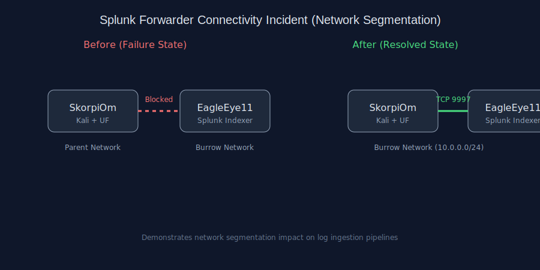

# Splunk Forwarder Connectivity Failure  
## Network Segmentation Impact on Log Ingestion

---

## Executive Summary

During routine validation of log ingestion within *The Burrow* cybersecurity lab, a failure was identified where a Splunk Universal Forwarder (SkorpiOm) was not successfully transmitting logs to the Splunk Enterprise indexer (EagleEye11).

Initial indicators suggested a potential configuration or service-level issue. However, investigation revealed the root cause to be **network segmentation caused by incorrect network association**, resulting in a silent breakdown of the logging pipeline.

This incident highlights the importance of validating **network-layer connectivity** when troubleshooting SIEM ingestion issues.

---

## Environment

| System        | Role                      | Platform     |
|---------------|---------------------------|--------------|
| EagleEye11    | Splunk Enterprise Indexer | macOS        |
| SkorpiOm      | Universal Forwarder       | Kali Linux   |
| Network       | Burrow Lab                | 10.0.0.0/24  |

---

## Indicators & Symptoms

- Forwarder status: **“Configured but inactive”**
- No events observed in Splunk searches
- Splunk UI displayed:
  - *Forwarder Ingestion Latency*
- Splunk receiver confirmed:
  - Port **9997 open and listening**
- Forwarder service:
  - Running normally (`systemctl status`)

---

## Investigation Process

### 1. Service Validation
```bash
sudo systemctl status SplunkForwarder
```

No service-level issues detected.

---

### 2. Configuration Verification
```bash
splunk list forward-server
```

Correct destination configured (`10.0.0.112:9997`).

---

### 3. Receiver Validation
```bash
sudo lsof -iTCP:9997 -sTCP:LISTEN
```

Splunk confirmed listening on ingestion port.

---

### 4. Connectivity Assumption Challenge

At this stage:
- Application layer OK  
- Configuration OK  
- Port availability OK  

Pivoted to **network-layer validation**.

---

### 5. Root Cause Identification

SkorpiOm was connected to a different wireless network than EagleEye11.

Although both systems had similar IP ranges (`10.0.0.x`), they existed on **separate network segments**, preventing communication.

---

## Root Cause

<<<<<<< HEAD
## Diagram

=======
**Network segmentation due to incorrect SSID association**

- SkorpiOm → Parent Network  
- EagleEye11 → Burrow Lab Network  

Result:
- No route between systems  
- Forwarder unable to establish connection  
- Splunk ingestion pipeline failed  

---
>>>>>>> 37ea4c9 (Added polished Splunk incident report with diagram)

## Resolution

Reconnected SkorpiOm to the correct Burrow network.

Verified connectivity:
```bash
ping 10.0.0.112
nc -vz 10.0.0.112 9997
```

---

## Verification

Generated test event:
```bash
logger "SPLUNK TEST EVENT"
```

Splunk search:
```spl
index=* "SPLUNK TEST EVENT"
```

Event successfully ingested and indexed.

---

## Network Diagram


---

## Security Impact

- Loss of log visibility  
- Detection blind spots  
- Delayed incident response  
- False assumption of monitoring coverage  

---

## Detection & Response Analysis

**Detection Method**
- Splunk Health Dashboard alert
- Absence of expected logs

**Response Actions**
- Verified forwarder and receiver
- Validated configuration
- Identified network issue
- Restored connectivity

---

## Lessons Learned

- Validate network layer early  
- “Configured but inactive” indicates connectivity issues  
- Same IP range does not guarantee same network  
- Simple tests save time:
```bash
ping <target>
nc -vz <target> 9997
```

---

## Improvements Implemented

- Standardized lab network usage  
- Planning static IP assignment  
- Moving to hostname-based forwarding  

---

## Conclusion

This issue was caused by **network segmentation due to incorrect network association**, not Splunk misconfiguration.

Resolving the issue restored full log ingestion and reinforced the importance of **network awareness in SIEM pipelines**.

---

**Time to Resolution:** ~1 hour  
**Skills Demonstrated:**
- Network troubleshooting  
- SIEM pipeline analysis  
- Splunk administration  
- Incident investigation  
