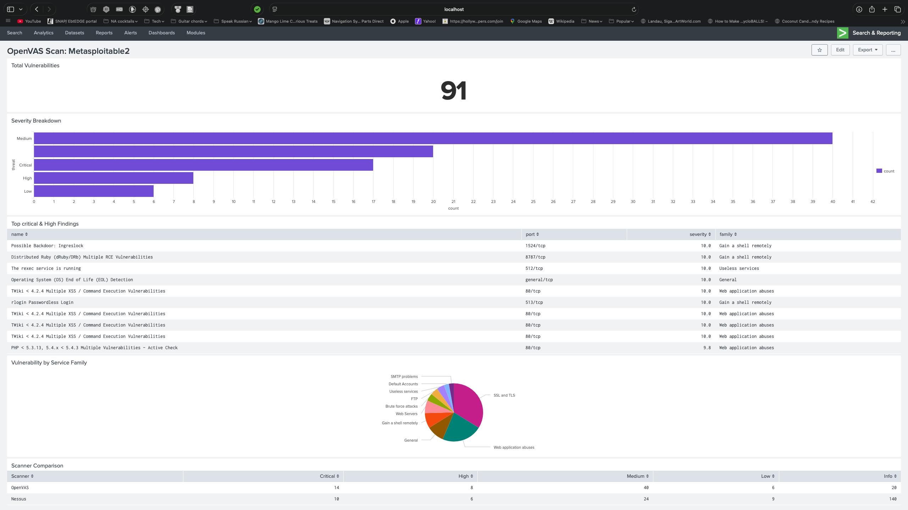

**Vulnerability Scanner Comparison**

OpenVAS (Greenbone CE) vs. Nessus Essentials

Target: Metasploitable 2 \| The Burrow Home Lab \| April 15, 2026

Author: JBird (jkgibson-source) \| Attack Machine: SkorpiOm (Kali Linux)

**1. Objective**

This report documents the results of running two industry-standard
vulnerability scanners against Metasploitable 2, a deliberately
vulnerable Linux VM used as a controlled target in The Burrow home lab.
The goal is to compare detection coverage, scoring methodology, and
practical differences between OpenVAS (Greenbone Community Edition) and
Nessus Essentials to develop scanner fluency and produce a
portfolio-quality analysis.

**2. Lab Environment**

Both scans were conducted from SkorpiOm (Kali Linux, MacBook Pro A1286)
without credentials. Metasploitable 2 ran in VirtualBox on the host-only
network (192.168.56.0/24), isolated from the main Burrow lab subnet
(10.0.0.0/24). No active defenses or IDS were present on the target
during scanning.

|  |  |  |  |
|:--:|:--:|:--:|:--:|
| **Machine** | **Role** | **IP** | **OS** |
| **EagleEye11** | SIEM (Splunk + Wazuh) | 10.0.0.10 | macOS M1 |
| **SkorpiOm** | Attack / Scanner | 10.0.0.210 | Kali Linux |
| **Metasploitable2** | Scan Target | 192.168.56.101 | Ubuntu (VirtualBox) |

**3. Scan Configurations**

**3.1 OpenVAS (Greenbone Community Edition GVM-25.04.0)**

- Scan task: Metasploitable2 - Full and Fast

- Target: 192.168.56.101

- UI: https://127.0.0.1:9392

- Credentialed: No

- Duration: ~35 minutes

**3.2 Nessus Essentials (v10.11.3, build 20047)**

- Scan task: Metasploitable2 - Basic Network Scan

- Target: 192.168.56.101

- UI: https://localhost:8834

- Credentialed: No (Auth: Fail)

- Duration: ~18 minutes

Note: An initial Nessus scan using the Host Discovery policy returned 0
vulnerabilities. Host Discovery is designed solely to enumerate live
hosts and does not perform vulnerability detection. The Basic Network
Scan policy was used for all results documented here.

**4. Results Summary**

|  |  |  |  |
|:--:|:--:|:--:|:--:|
| **Metric** | **OpenVAS (GCE)** | **Nessus Essentials** | **Notes** |
| **Scan Policy** | Full and Fast | Basic Network Scan | Both unauthenticated |
| **Scan Duration** | ~35 minutes | ~18 minutes | Nessus ~2x faster |
| **Critical** | **14** | **10** | OpenVAS found more Criticals |
| **High** | **8** | **6** |  |
| **Medium** | **40** | **24** | OpenVAS more verbose |
| **Low** | **6** | **9** | Nessus slightly more Low |
| **Info / Log** | 90 | 140 | Nessus more verbose on Info |
| **Total Findings** | **158** | **189** | Nessus higher total due to Info |
| **Credentialed** | No | No (Auth: Fail) | Both surface-level only |
| **CVE Coverage** | Explicit CVE IDs in findings | CVSS + VPR scores, fewer explicit CVEs | OpenVAS more CVE-centric |

Key observation: Nessus returned a higher total finding count (189 vs
158), but the difference is driven primarily by Info-level entries (140
vs 90). At the actionable severity levels (Critical + High), OpenVAS
identified more findings (22) compared to Nessus (16). Both scanners
were run without credentials, which limits their ability to perform
host-level checks beyond network-accessible services.

### 📊 Splunk Visualization

To further analyze and normalize scanner output, a Splunk dashboard was built to visualize severity distribution, top findings, and side-by-side comparison metrics.

> Note: Nessus data in the dashboard was manually represented due to export limitations in Nessus Essentials. This reflects a common real-world challenge when integrating heterogeneous security tools into a unified analysis pipeline.

**5. Notable Findings and CVE Overlap**

The following table maps key vulnerabilities across both scanners. Due
to differing plugin naming conventions, some findings may be present in
both scanners under different labels. Nessus groups some CVEs under
broader plugin names (e.g., Apache Tomcat group, SSL Multiple Issues),
making direct one-to-one mapping non-trivial without drilling into
individual findings.

|  |  |  |  |
|:--:|:--:|:--:|:--:|
| **Vulnerability** | **CVE / Identifier** | **OpenVAS** | **Nessus** |
| vsftpd backdoor | CVE-2011-2523 | **Critical** | Not listed (see note) |
| Ghostcat / AJP | CVE-2020-1938 | **Critical** | Apache Tomcat group |
| DistCC RCE | CVE-2004-2687 | **Critical** | Not confirmed |
| SSL v2/v3 deprecated | Protocol weakness | **Critical** | **Critical (9.8)** |
| Bind Shell Backdoor | Unknown listener | Not listed | **Critical (9.8)** |
| VNC password auth | Weak credential | Not confirmed | **Critical (10.0)** |
| MySQL default creds | Default credential | **Critical** | Not confirmed |
| NFS world readable | Misconfiguration | **Critical** | **High (7.5)** |
| Samba Badlock | CVE-2016-2118 | **Medium** | **High (7.5)** |
| rlogin service | Legacy service | Not listed | **High (7.5)** |
| PHP vulnerabilities | Multiple CVEs | **Critical/High** | Likely in Medium group |
| rexec service | Legacy service | **Critical** | Not confirmed |

Note: 'Not confirmed' indicates the vulnerability was not observed in
the visible findings list and may be absent, grouped under a different
plugin name, or rated at a lower severity by that scanner. Further
drill-down into individual findings is needed to confirm absence.

**6. Tool Comparison**

|  |  |  |
|:--:|:--:|:--:|
| **Category** | **OpenVAS (Greenbone CE)** | **Nessus Essentials** |
| **Cost** | Free / open source | Free (16 IPs max) |
| **Interface** | Web UI (port 9392) | Web UI (port 8834) |
| **Scoring System** | CVSS v3 only | CVSS v3 + VPR (Tenable-proprietary risk scoring) |
| **CVE Reporting** | Explicit CVE IDs prominent in findings | CVEs present but CVSS/VPR scores are primary focus |
| **Strengths** | More explicit CVE mapping; better for learning vulnerability names; open source/auditable | Faster scans; VPR adds exploit likelihood context; Remediations tab; cleaner UI |
| **Limitations** | Slower; heavier resource use; UI less polished | 16-IP cap on Essentials; some CVEs grouped under generic plugin names |
| **Industry Use** | Common in open-source SOC and academic environments | Standard in enterprise environments; widely referenced in job descriptions |
| **Target Machine** | SkorpiOm (Kali Linux) | SkorpiOm (Kali Linux) |

**7. Key Takeaways**

**Scanner Selection Context**

- Neither scanner is universally superior — each has different strengths
  depending on the use case.

- OpenVAS is better suited for CVE-centric learning and environments
  where open-source tooling is preferred or required.

- Nessus is the industry-standard enterprise scanner and is referenced
  heavily in SOC analyst and vulnerability management job descriptions.

- Running both scanners provides broader coverage and reduces the risk
  of missed findings.

**Scan Policy Matters**

- Nessus Host Discovery policy returns 0 vulnerability findings by
  design — it is a host enumeration tool, not a vulnerability scanner.

- Selecting the correct scan policy (Basic Network Scan or Advanced
  Scan) is a prerequisite to meaningful results.

- OpenVAS Full and Fast is a reasonable default for lab use; more
  thorough policies increase scan time significantly.

- Visualization of scanner output in Splunk highlighted differences in severity distribution and  classification methodology between tools.

**Unauthenticated vs. Credentialed Scanning**

- Both scans were unauthenticated. Credentialed scans would expose
  significantly more findings, particularly local privilege escalation
  paths, missing patches, and OS-level misconfigurations.

- The Auth: Fail status in Nessus is expected without supplied SSH or
  SMB credentials.

- A credentialed follow-up scan is recommended as a next step to
  demonstrate the coverage gap.

**8. Next Steps**

- Run a credentialed Nessus scan against Metasploitable2 to compare
  authenticated vs. unauthenticated coverage.

- Ingest OpenVAS GVM logs into Splunk via Universal Forwarder on
  SkorpiOm for real-time SIEM correlation.

- Drill into individual Nessus findings to resolve 'Not confirmed'
  entries in the CVE overlap table.

- Exploit selected confirmed CVEs (vsftpd backdoor, DistCC RCE) and
  cross-reference against scanner findings for validation.

- Run both scanners against SkorpiOm (Kali Linux) for a hardened-host
  baseline comparison.

*The Burrow Home Lab \|
github.com/jkgibson-source/cybersecurity-home-lab*
