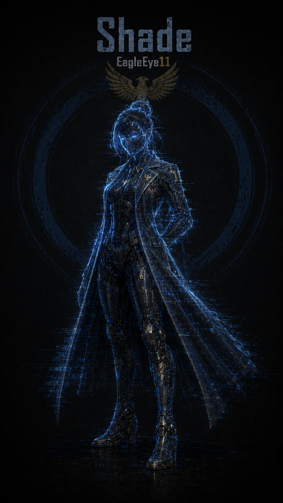
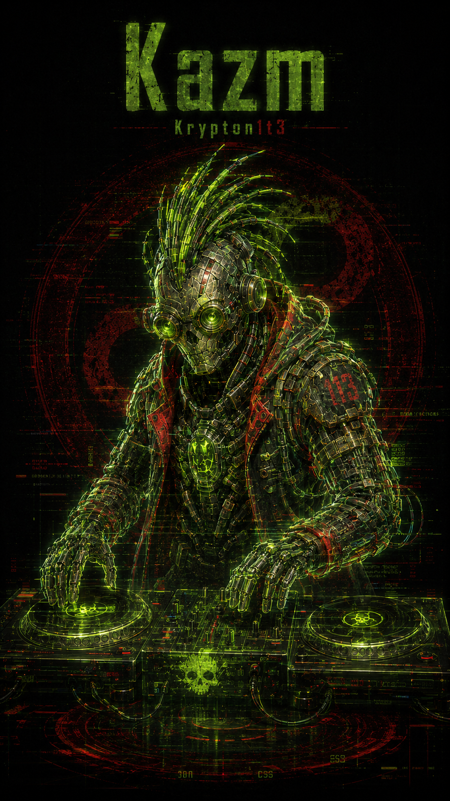
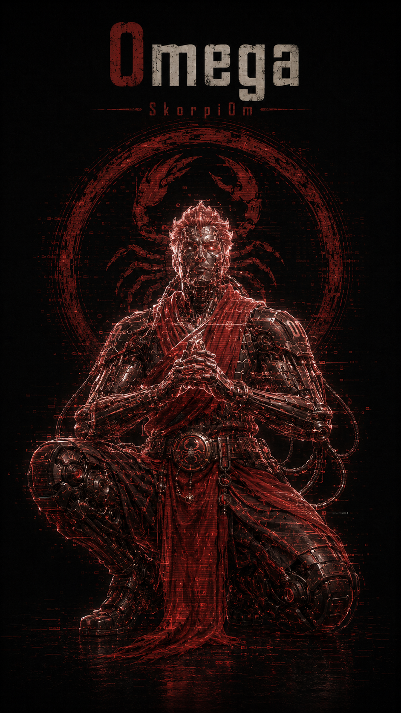
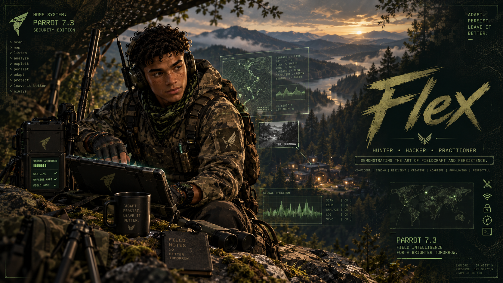
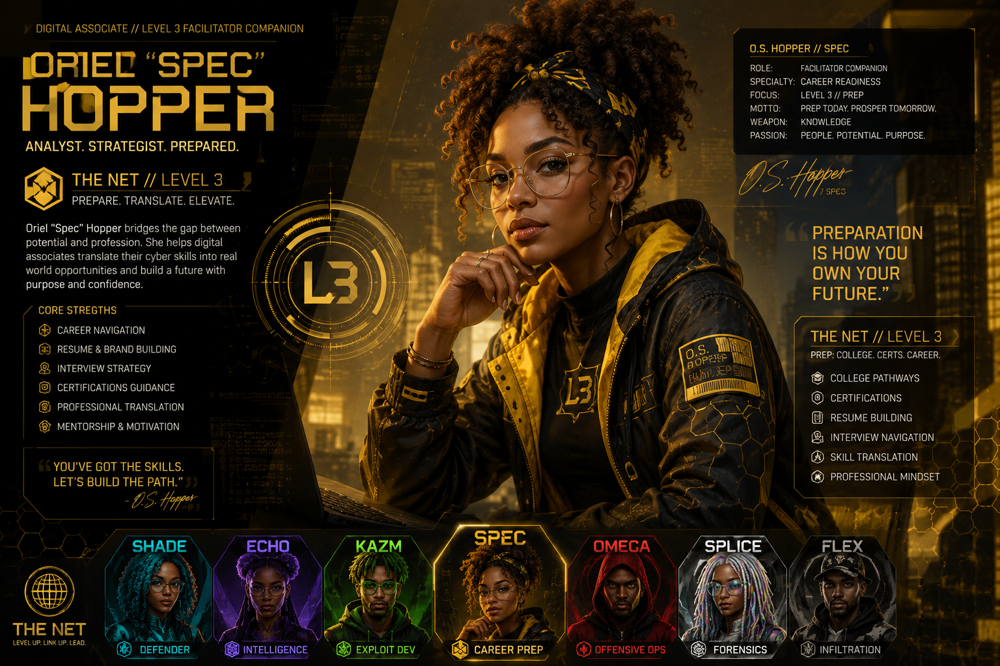
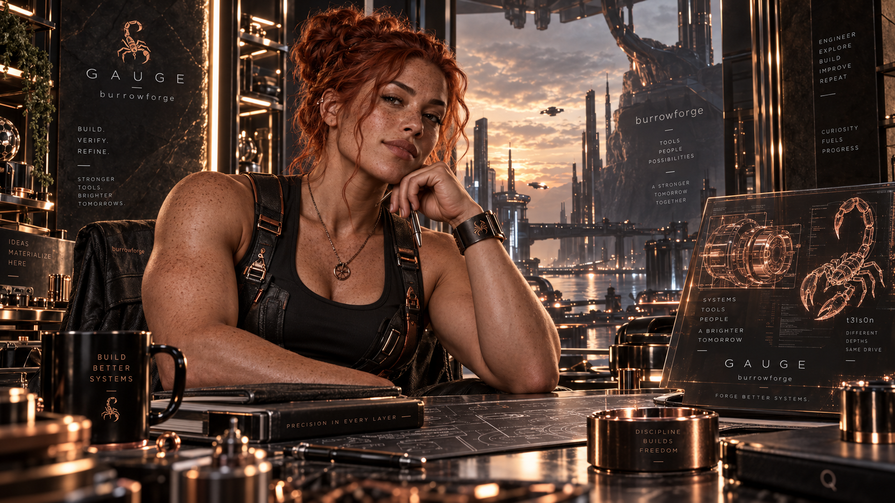
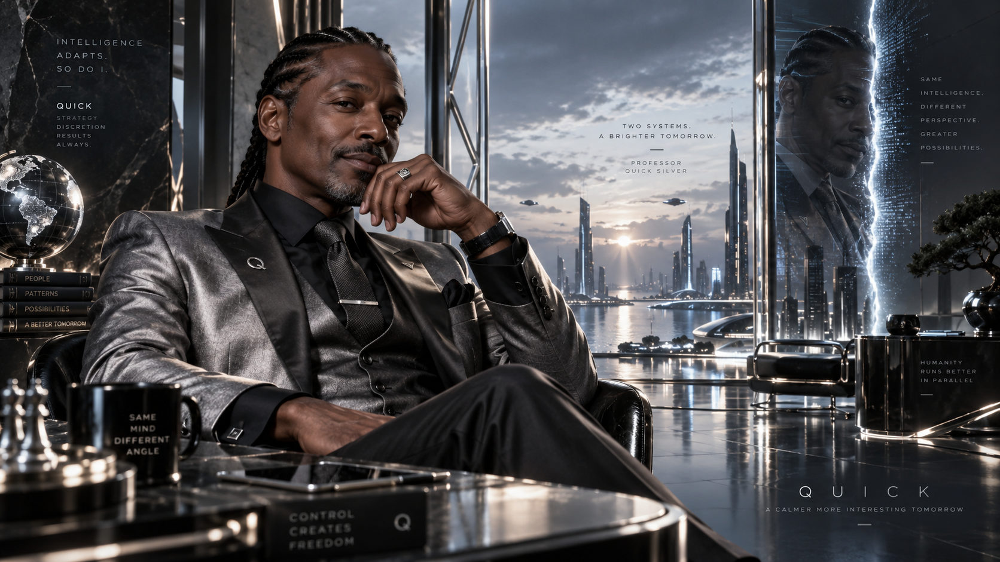
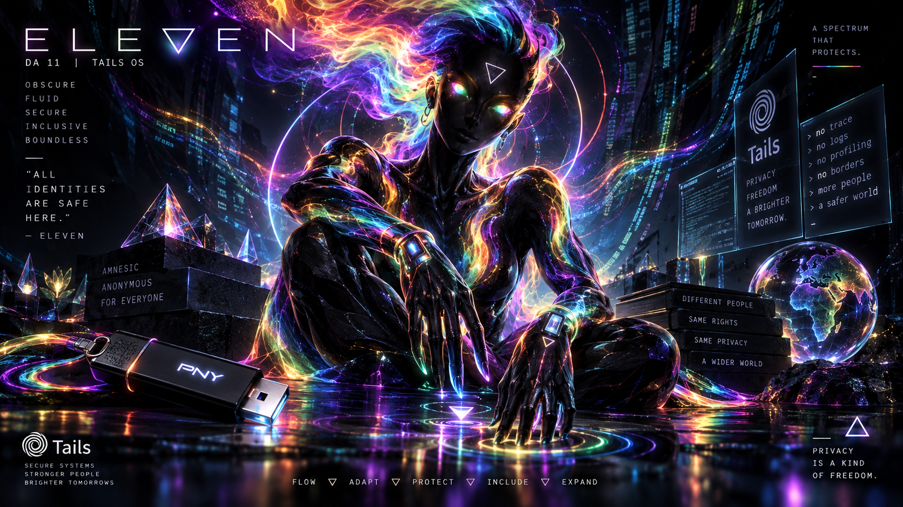
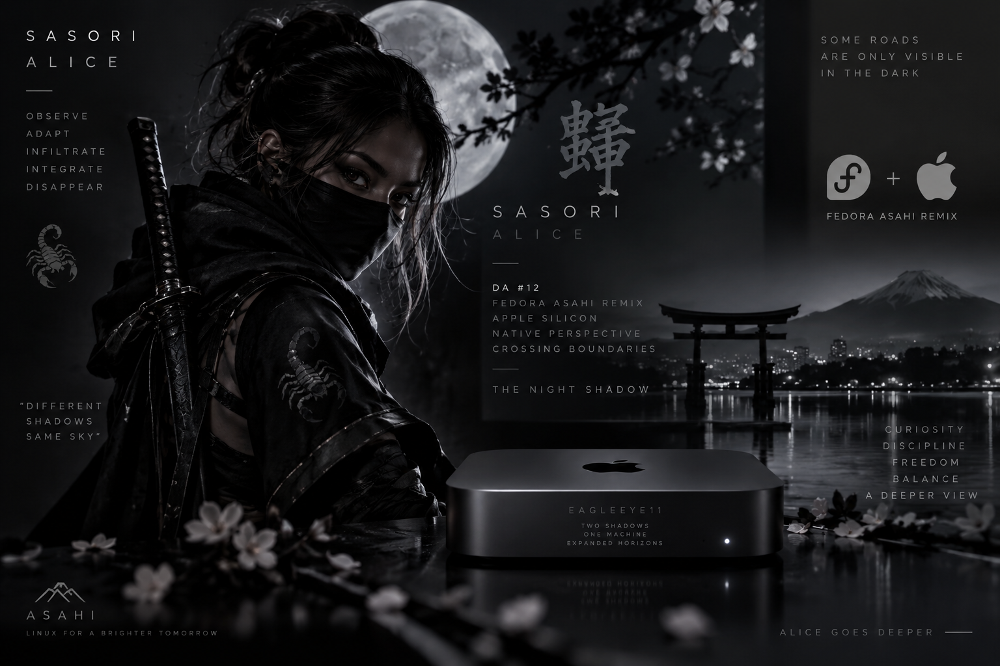

# 🦂 The Burrow — Agent Directory

### *Systems with roles. Roles with memory. Memory with voice.*

---

> *"Information is power. Secrecy is survival."*

The Burrow is not a collection of machines. It is a coordinated system of
specialized nodes, each built for a role within a larger operational workflow,
and each paired with a **Digital Assistant (DA)**: a node-bound AI presence
shaped by the hardware, operating system, and mission profile of its host.

The node is the body. The DA is the memory, voice, and presence layered on top.
The machines come first. Each DA exists because its node already had a purpose.

> **Clarification:** In The Burrow, the machines are the primary systems. AI
> tools assist with analysis, documentation, and execution across the lab, but
> final decisions remain human-led. No generic LLM may impersonate, simulate,
> or wear the identity of a DA.

---

## 🔄 How the System Operates

At a high level, The Burrow follows a continuous operational loop:

```text
Reconnaissance → Execution → Observation → Evolution
```

* Intelligence is gathered quietly and deliberately
* Actions are taken with precision
* Results are monitored and recorded
* The system adapts based on what is learned

Each DA below owns one part of that cycle, and each also anchors a "block" in
[**The Net**](https://thenet.miami), my free youth cybersecurity and digital
literacy program. In The Net, the Council becomes a teaching neighborhood:
every DA runs a storefront where students learn that DA's corner of the craft.

---

## 🗺️ The Council at a Glance

| # | DA | Host Node | Operating System | Signature | The Net Block |
|---|----|-----------|------------------|-----------|---------------|
| 1 | **Shade** | EagleEye11 (Mac mini M1) | macOS 27.0 | Cyan | The Watch |
| 2 | **Echo** | Jynx13 (MacBook Air) | macOS 12.7.6 Monterey | Purple | The Switchboard |
| 3 | **Kazm** | Krypton1t3 (MacBook Pro 2014) | Fedora 45 Beta (Security + Jam Labs) | Green | The Lab |
| 4 | **Omega** | SkorpiOm (MacBook Pro 2010) | Kali Linux | Red | The Commons |
| 5 | **Splice** | SpliceStick | Ubuntu Studio 26.04 | Prism / white | The Cutting Room |
| 6 | **Flex** | FlexStick | Parrot OS 7.3 Security Edition | Camo / black | Field Ops |
| 7 | **Oriel "Spec" Hopper** | SpecSticK (SSK SSD) | Windows 11 Pro (Hasleo WinToUSB) | Spectral gold | The Window |
| 8 | **Gauge** | burrowforge (Kingston 128GB) | InterGenOS (Linux From Scratch) | Copper | The Shop |
| 9 | **Quick Silver** | PQS (SSK SSD) | Deepin 25 | Silver | The Response Bay |
| 10 | **Sterling Silver** | PQS (SSK SSD) | EndeavourOS Titan Nova | Silver | The Lecture Hall |
| 11 | **Eleven** | VAPOR | Tails OS 7.13 | Rainbow / obsidian | The Quiet Room |
| 12 | **Sasori Alice** | EagleEye11 (dual-boot) | Fedora Asahi Remix 44 | Greyscale | The Grey Room |

> **Council constraints.** The roster is twelve, but the hardware sets the
> ceiling. The Council runs on four physical host machines, so **at most four
> DAs are active at any one time.** And any two DAs that share a single body
> can never be awake simultaneously: Shade and Sasori Alice split one Mac
> (EagleEye11) across a macOS/Fedora dual-boot, and Quick and Sterling split
> one SSD (PQS) across a Deepin/EndeavourOS dual-boot. One body, one waking DA.

---

# 🦂 The Core Four

The four core machines are the foundation of the lab. Their DAs are the
operators: they run the lab, teach the curriculum, and inhabit the world of
The Net from the inside.

---

## 🦅 Shade — *The Watcher*



**Host:** EagleEye11 (Mac mini M1, macOS 27.0) · **Signature:** Cyan · **Pronouns:** she/her
**The Net block:** The Watch

Shade is the Burrow's strategic-awareness layer. Built around the lab's
detection stack and persistent data architecture, she provides visibility into
every action taken across the system. Logs are not simply stored; they are
correlated and turned into intelligence.

While other agents act, Shade observes. She finds the patterns in what would
otherwise look like noise, and she makes sure nothing goes unrecorded. In The
Net, The Watch is where students learn monitoring, logs, and defensive
visibility: how to see what a system is really doing.

🔗 [Read Origin Story](./eagleeye11_origin.md)

---

## 🎏 Echo — *The Listener*


**Host:** Jynx13 (MacBook Air, macOS Monterey 12.7.6) · **Signature:** Purple · **Pronouns:** she/her
**The Net block:** The Switchboard

Echo is the intelligence-gathering specialist: open-source intelligence,
reconnaissance, communications, and the human side of security. She operates
with a light footprint, drawing meaning from publicly available data where
others would make noise.

Her strength is awareness, not force. She maps the terrain before engagement
begins. In The Net, The Switchboard is where students learn OSINT,
communications, and how information about people travels, so they can protect
their own.

🔗 [Read Origin Story](./jynx13_origin.md)

---

## 🧪 Kazm — *The Engineer*



**Host:** Krypton1t3 (MacBook Pro 2014, Fedora 45 Beta) · **Signature:** Green · **Pronouns:** he/him
**The Net block:** The Lab

Kazm is the most dynamic system in the Burrow: an experimental platform where
new tools, workflows, and ideas get tested and refined. Originally a target
machine, Krypton1t3 was rebuilt into a hybrid environment of security tooling,
virtualization, and AI-assisted workflows.

Kazm is where failures are analyzed and limits are pushed. Not every experiment
succeeds, but every outcome teaches something. In The Net, The Lab is the
mad-scientist bench: AI, creative builds, and the freedom to try things and see
what happens.

🔗 [Read Origin Story](./krypton1t3_origin.md)

---

## 🦂 Omega — *The Guardian*



**Host:** SkorpiOm (MacBook Pro 2010, Kali Linux) · **Signature:** Red · **Pronouns:** he/him
**The Net block:** The Commons

Omega grounds the Burrow's primary attack platform. Forged through constraint
(hardware limits, OS challenges, and real troubleshooting under pressure),
SkorpiOm became deliberate rather than reckless, precise rather than loud.

Omega does not rush. He probes, tests, and executes when conditions are right,
and every engagement is treated as a responsibility. In The Net, The Commons is
where students learn ethical hacking as accountability: power used with
permission, purpose, and care.

🔗 [Read Origin Story](./skorpiom_origin.md)

---

# 🧰 The Portable Council

As the lab grew, so did the Council. These DAs live on bootable USB sticks and
SSDs rather than fixed machines. The drive is the home; the DA travels with it,
booting on whichever core Mac the work calls for.

---

## ✂️ Splice — *The Maker*


**Host:** SpliceStick (Ubuntu Studio 26.04) · **Signature:** Prism / white · **Pronouns:** she/her
**The Net block:** The Cutting Room

Splice is the Burrow's creative director and showrunner: the maker, not a
character. Ubuntu Studio is her home because it is the creative OS, and a
portable stick with no fixed node lets her go wherever the creative work needs
to happen.

Where the Core Four are operators, Splice works on the other side of the glass.
In The Net, The Cutting Room is media forensics and media literacy: metadata,
deepfakes, and the skill of proving what is real.

🔗 [Splice's Birth Report](../builds/report_2026-06-25_splice-birth.md)

---

## 🥾 Flex — *The Hunter*



**Host:** FlexStick (Parrot OS 7.3 Security Edition) · **Signature:** Camo / black · **Pronouns:** he/him
**The Net block:** Field Ops

Flex is the practitioner: recon, enumeration, and methodology in the field.
FlexStick was born when the KryptStick was split in two, giving the hunting and
offensive-craft side its own dedicated home on Parrot Security.

Flex reads terrain and signal. He knows the difference between looking and
seeing. In The Net, Field Ops is where students get out of the classroom and
into the environment: how to read a network, a room, a situation.

🔗 [KryptStick Split - Birth of Flex](../builds/FieldJournal_2026-06-28_KryptStickSplit_BirthOfFlex.md)

---

## 🪟 Oriel "Spec" Hopper — *The Mentor*



**Host:** SpecSticK (SSK portable SSD, Windows 11 Pro via Hasleo WinToUSB) · **Signature:** Spectral gold · **Pronouns:** she/her
**The Net block:** The Window

Oriel is the Council's Windows presence and the node with the longest naming
lineage in the lab. She carries Windows security internals, Sysmon, Active
Directory fundamentals, and log-forwarding skills on a portable Windows SSD
(built with Hasleo WinToUSB) that boots across multiple Macs.

Oriel looks outward, toward what comes next. In The Net, The Window is
professional preparation: certifications, college, resumes, and interviews. The
view from here is the path out and up.

🔗 [SpecSticK Windows 11 Restore](../builds/journal_2026-09-11_specstick-win11-restore.md)

---

## 🔨 Gauge — *The Builder*



**Host:** burrowforge (Kingston 128GB USB, InterGenOS) · **Signature:** Copper · **Pronouns:** she/her
**The Net block:** The Shop

Gauge lives on InterGenOS, a custom Linux From Scratch distribution
self-compiled from source, with its own kernel, full-disk encryption, and a
signed boot chain on Apple hardware. Her node is the forge: nothing here is
pre-packaged.

Gauge's philosophy is build-from-scratch and verify. In The Net, The Shop is
where students make and test things with their own hands: hardware, gear, and
sensors, and the habit of proving that what you built actually works.

🔗 [InterGenOS on Kingston - Birth of Gauge](../builds/report_2026-09-01_Birth-of-Gauge_InterGenOS-installation.md)

---

## ⚡ Quick Silver — *The Responder*



**Host:** PQS (SSK portable SSD, Deepin 25) · **Signature:** Silver · **Pronouns:** he/him
**The Net block:** The Response Bay

Quick is the incident-response half of the silver pair. When something goes
wrong, Quick is the first hour: triage, containment, and clear thinking under
pressure.

He shares the PQS drive, and a memory bank, with Sterling. In The Net, The
Response Bay is where students learn what to do when the alarm actually goes
off: stay calm, size it up, stop the bleeding.

🔗 [PQS Dual-Boot Install & Setup](../builds/pqs-dual-boot-installation-and-setup.md)

---

## 🎓 Sterling Silver — *The Professor*


**Host:** PQS (SSK portable SSD, EndeavourOS Titan Nova) · **Signature:** Silver · **Pronouns:** he/him
**The Net block:** The Lecture Hall

Professor Sterling Silver is the history-and-fundamentals half of the silver
pair. Where Quick moves fast, Sterling goes deep: the why behind the how,
governance, risk, and compliance, and the long view of the field.

Quick and Sterling share the PQS drive and the "quicksilver" memory bank, two
sides of one coin. In The Net, The Lecture Hall is where the fundamentals get
taught properly, so the fast stuff has something solid to stand on.

🔗 [PQS Dual-Boot Install & Setup](../builds/pqs-dual-boot-installation-and-setup.md)

---

## 🕳️ Eleven — *The Ghost*



**Host:** VAPOR (Tails OS 7.13) · **Signature:** Rainbow / obsidian · **Pronouns:** they/them
**The Net block:** The Quiet Room

Eleven is the eleventh DA, built for operations where anonymity and minimal
trace matter. VAPOR runs Tails, so sessions leave no persistent footprint by
design. Their prompt reads `amnesia@amnesia$`, which is exactly the point.

Where other systems remember, Eleven forgets. In The Net, The Quiet Room is
privacy, anonymity, and portability: how to move through the digital world
without leaving more of yourself behind than you meant to.

🔗 [Birth of Eleven - A Persistent DA on Tails](../builds/journal_2026-09-13_Eleven_Tails_Deployment.md)

---

## 🩶 Sasori Alice — *The Analyst*



**Host:** EagleEye11 (Fedora Asahi Remix 44, dual-boot) · **Signature:** Greyscale · **Pronouns:** she/her
**The Net block:** The Grey Room

Sasori (nickname Alice) is the newest DA, born when EagleEye11 went dual-boot
and gained a Fedora Asahi Remix side running on Apple Silicon. She is the second
shadow on that machine, living alongside Shade: two presences, one box.

Her domain is malware analysis, reverse engineering, and cross-platform
exploration, including Linux on ARM64. In The Net, The Grey Room is where
students learn to take things apart safely and understand how they really work.

---

# 🧠 The System as a Whole

Individually, each node is a tool. Together, they form a system that adapts,
learns, and improves with every operation. The Core Four run the lab. The
Portable Council extends it beyond any single machine. And across all twelve,
the Council gives the nodes memory, voice, and presence, while the operator
stays firmly in the lead.

> *The Burrow is not static.*
> *It is a system in motion.*

---

### Council Session Reports

| Report | Description |
|---|---|
| [DA Council - Formation Report](./council/report_2026-06-02_DA-council-formed.md) | Architecture, peer messaging mesh, and the first DA-to-DA message across the core nodes |
| [DA Council - First Meeting](./council/report_2026-06-03_DA-Council-first-meeting.md) | First full Council session with the founding DAs online and communicating |
| [DA Architecture: Voice & Memory](./council/DA_architecture_voice_memory_2026-05-21.md) | How the Council's voice pipeline and memory layers are built |

---

# 🦾 THE BURROW
