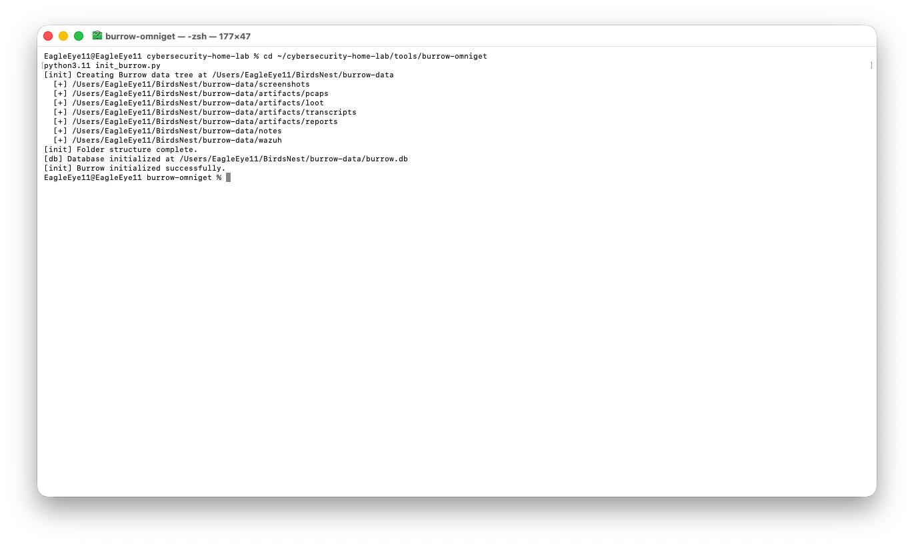
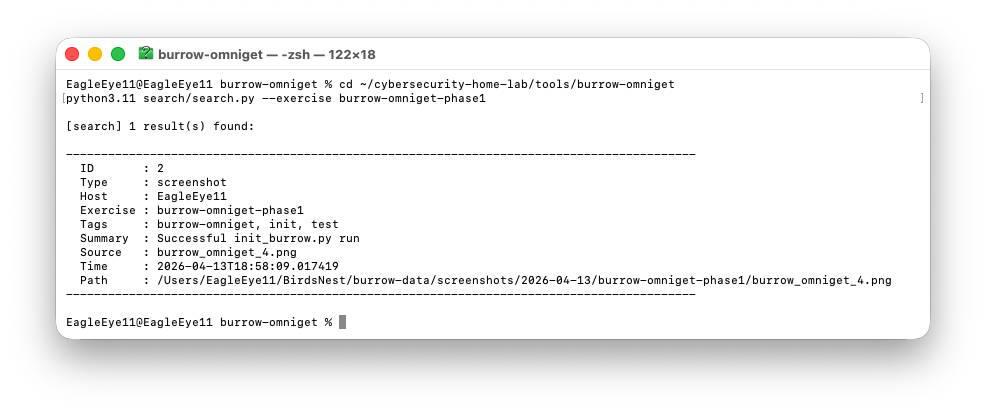

# Burrow OmniGet

**Burrow OmniGet** is a local evidence ingestion and centralization tool for The Burrow cybersecurity home lab. It provides a unified pipeline for capturing screenshots, artifacts, and analyst notes from any exercise or engagement — storing everything on Bird's Nest with consistent metadata, JSON sidecars, and a SQLite backbone.

This is Phase 1 of a multi-phase build that will eventually include keyword search, semantic search via Chroma embeddings, a correlation engine, and an LLM analyst layer via Ollama.

---

## Architecture

```
~/BirdsNest/burrow-data/
├── screenshots/          # Ingest via ingest_screenshot.py
├── artifacts/
│   ├── pcaps/            # Ingest via ingest_artifact.py --type pcap
│   ├── loot/             # Ingest via ingest_artifact.py --type loot
│   ├── transcripts/      # Ingest via ingest_artifact.py --type transcript
│   └── reports/          # Ingest via ingest_artifact.py --type report
├── notes/                # Ingest via ingest_note.py
├── wazuh/                # Reserved for Wazuh alert exports
└── burrow-data/
    └── burrow.db         # SQLite evidence metadata store
```

All ingested files are organized by date (`YYYY-MM-DD`) and exercise label. Each file receives a JSON sidecar with full metadata. Every ingest operation is logged to the `evidence` table in `burrow.db`.

---

## Setup

**Requirements:** Python 3.11+, Bird's Nest mounted at `/Volumes/Bird's Nest` (symlinked to `~/BirdsNest`)

```bash
cd ~/cybersecurity-home-lab/tools/burrow-omniget
pip3.11 install -r requirements.txt
python3.11 init_burrow.py
```

`init_burrow.py` creates the full `burrow-data/` directory tree on Bird's Nest and initializes `burrow.db`. Safe to re-run — existing data is never overwritten.

---

## Usage

### Ingest a Screenshot

```bash
python3.11 ingest/ingest_screenshot.py <image_path> \
  --host <hostname> \
  --tags <tag1> <tag2> \
  --summary "Brief description" \
  --exercise <exercise-label>
```

**Example:**
```bash
python3.11 ingest/ingest_screenshot.py ~/Desktop/nmap_scan.png \
  --host krypton1t3 \
  --tags nmap recon port-scan \
  --summary "Initial nmap scan of Krypton1t3 showing open ports" \
  --exercise krypton1t3-pentest
```

---

### Ingest an Artifact

Supported types: `pcap`, `loot`, `transcript`, `report`

```bash
python3.11 ingest/ingest_artifact.py <file_path> \
  --type <artifact_type> \
  --host <hostname> \
  --tags <tag1> <tag2> \
  --summary "Brief description" \
  --exercise <exercise-label>
```

**Example:**
```bash
python3.11 ingest/ingest_artifact.py ~/captures/vnc_traffic.pcap \
  --type pcap \
  --host krypton1t3 \
  --tags wireshark vnc capture \
  --summary "VNC traffic capture during port 5900 exploitation attempt" \
  --exercise krypton1t3-pentest
```

---

### Ingest a Note

Accepts markdown (`.md`) files only.

```bash
python3.11 ingest/ingest_note.py <note_path> \
  --host <hostname> \
  --tags <tag1> <tag2> \
  --summary "Brief description" \
  --exercise <exercise-label>
```

**Example:**
```bash
python3.11 ingest/ingest_note.py ~/notes/recon_findings.md \
  --host krypton1t3 \
  --tags recon findings analyst-note \
  --summary "Manual recon notes after nmap and Netgear Armor scan review" \
  --exercise krypton1t3-pentest
```

---

## SQLite Schema

All ingest operations write to the `evidence` table in `~/BirdsNest/burrow-data/burrow.db`:

| Column      | Type    | Description                          |
|-------------|---------|--------------------------------------|
| id          | INTEGER | Auto-increment primary key           |
| type        | TEXT    | screenshot, pcap, loot, note, etc.   |
| source      | TEXT    | Original filename                    |
| timestamp   | TEXT    | ISO 8601 timestamp at ingest time    |
| host        | TEXT    | Target or source hostname            |
| tags        | TEXT    | JSON array of tags                   |
| summary     | TEXT    | Analyst-provided description         |
| path        | TEXT    | Absolute path to file on Bird's Nest |
| exercise    | TEXT    | Engagement or exercise label         |

---

## Build Phases

| Phase | Description                          | Status      |
|-------|--------------------------------------|-------------|
| 1     | Data centralization — ingest + SQLite | ✅ Complete |
| 2     | Search — keyword + metadata queries  | ⬜ Planned  |
| 3     | Semantic layer — Chroma embeddings   | ⬜ Planned  |
| 4     | Correlation engine                   | ⬜ Planned  |
| 5     | LLM analyst layer via Ollama         | ⬜ Planned  |

---

## Screenshots

**Initializing the data tree on Bird's Nest:**



**Searching the evidence database:**



---

## Notes

- All data lives on Bird's Nest external drive — not the internal SSD
- Vector DB: Chroma (lightweight, Python-native, right fit for 8GB M1)
- SQLite handles all metadata in Phases 1–2; Chroma added in Phase 3
- Can be extracted from the monorepo later via `git subtree split --prefix=tools/burrow-omniget`
